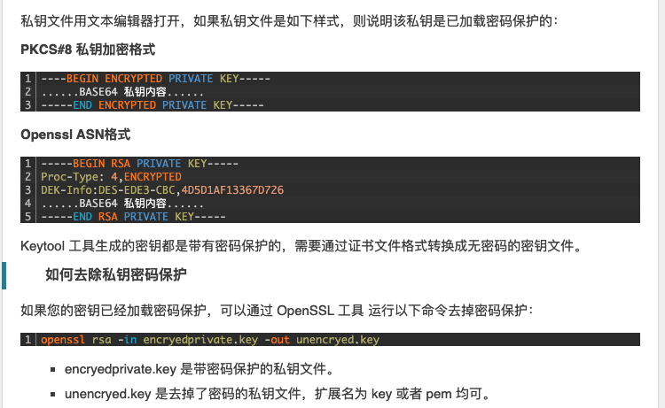

---
kind:
  - Troubleshooting
products:
  - Alauda Container Platform
  - Alauda DevOps
  - Alauda AI
  - Alauda Application Services
  - Alauda Service Mesh
  - Alauda Developer Portal
ProductsVersion:
  - 4.1.0,4.2.x
---
<!-- A type of document that involves encountering a fault, diagnosing it, performing root cause analysis, and providing solutions. -->

# 创建保密字典证书失败

创建保密字典证书失败 报错不识别私钥类型 不识别BEGIN RSA PRIVATE KEY

## Cause
- 证书私钥存在密码保护
- 平台使用openssl解密时无法识别带密码的RSA格式私钥

## Resolution
- 使用命令去除私钥密码保护：openssl rsa -in encrypted.key -out decrypted.key

## [workaround]

## [Related Information]
**Screenshots**

- Environment: 通用
- RSA PRIVATE KEY
- 保密字典证书
- openssl
- Component: (待归类)
- Page ID: 119087434
- Original Title: 创建保密字典证书失败
