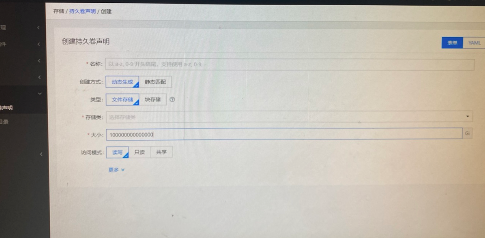
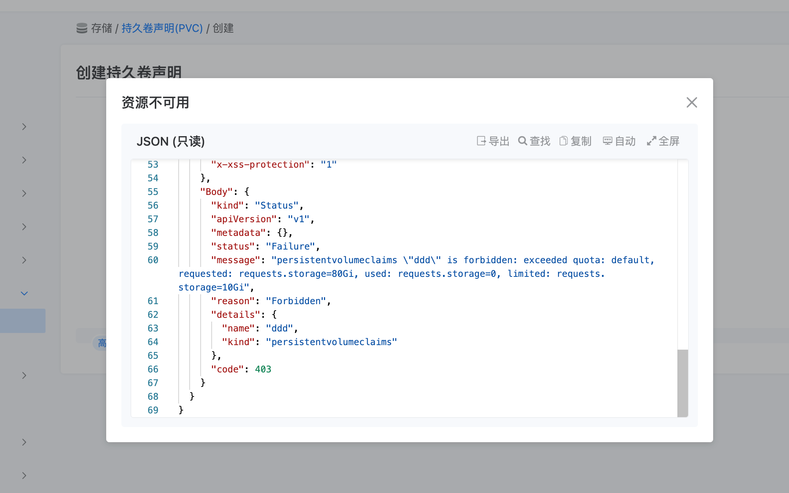

---
kind:
  - Troubleshooting
products:
  - Alauda Container Platform
  - Alauda DevOps
  - Alauda AI
  - Alauda Application Services
  - Alauda Service Mesh
  - Alauda Developer Portal
ProductsVersion:
  - 4.1.0,4.2.x
---
<!-- A type of document that involves encountering a fault, diagnosing it, performing root cause analysis, and providing solutions. -->

# 创建pvc时可以超过命名空间限额

创建PVC时输入超过命名空间限额的数值未触发即时验证 提交PVC创建请求后返回403错误

## Cause
- PVC创建界面未在前端对输入值进行限额验证
- 后端在提交阶段才执行命名空间资源配额检查

## Resolution
- 实际提交时后端会触发资源配额验证机制
- 超过限额的PVC创建请求会被拒绝并返回403状态码

## [workaround]

## [Related Information]
**Screenshots**

- Environment: 通用
- PersistentVolumeClaim
- ResourceQuota
- 命名空间资源配额
- 后端验证机制
- Component: (待归类)
- Page ID: 119087566
- Original Title: 创建pvc时可以超过命名空间限额
