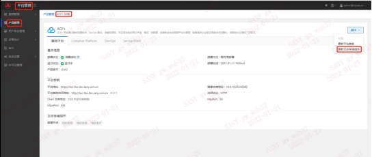

---
kind:
  - Troubleshooting
products:
  - Alauda Container Platform
  - Alauda DevOps
  - Alauda AI
  - Alauda Application Services
  - Alauda Service Mesh
  - Alauda Developer Portal
ProductsVersion:
  - 4.1.0,4.2.x
---
<!-- A type of document that involves encountering a fault, diagnosing it, performing root cause analysis, and providing solutions. -->

# 平台日志扩容方案

新增加的节点上无分片存在 集群状态未变为yellow或green

## Cause
- 扩容前未禁止分片分配
- 缩容前未迁移目标节点分片

## Resolution
- PUT _cluster/settings禁用分片分配
- kubectl edit prdb base修改es节点IP
- GET _cat/health检查集群状态
- PUT _cluster/settings恢复分片分配

## [workaround]
- 操作期间保持cluster.routing.allocation.enable=none

## [Related Information]
**Screenshots**

- Environment: 3.4, 3.6
- _cluster/settings
- _cat/health
- _cat/nodes
- cpaas-elasticsearch:9200
- kibana
- kubectl
- productbase
- sentry-cm
- Component: (待归类)
- Page ID: 119088548
- Original Title: 平台日志扩容方案-横向扩容
