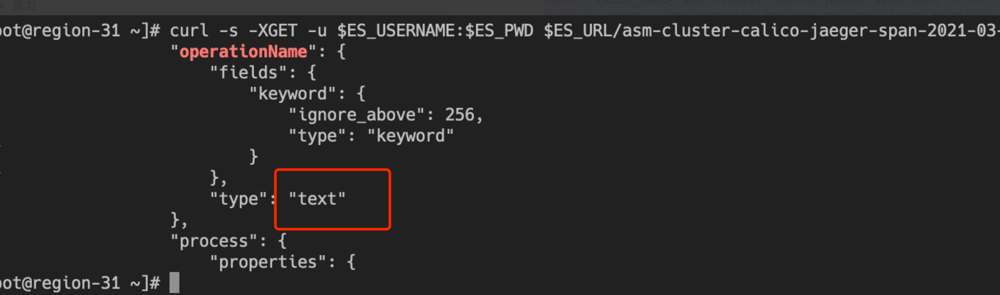

---
kind:
  - Troubleshooting
products:
  - Alauda Container Platform
  - Alauda DevOps
  - Alauda AI
  - Alauda Application Services
  - Alauda Service Mesh
  - Alauda Developer Portal
ProductsVersion:
  - 4.1.0,4.2.x
---
<!-- A type of document that involves encountering a fault, diagnosing it, performing root cause analysis, and providing solutions. -->

# ASM调用链无数据

调用链查询无数据

## Cause
- 索引类型为'text'而非'keyword'
- 暴力删除索引或删除Elasticsearch数据目录导致索引类型错误

## Resolution
- 清除对应的索引，重启jaeger-collector和jaeger-query组件生成新索引

## [workaround]

## [Related Information]
**Screenshots**

- Environment: 3.8.x
- jaeger-prod-collector
- asm-mesh-<cluster name>-jaeger-span-<date>
- ES_URL
- ES_USERNAME
- ES_PWD
- Component: (待归类)
- Page ID: 120095026
- Original Title: ASM调用链无数据
