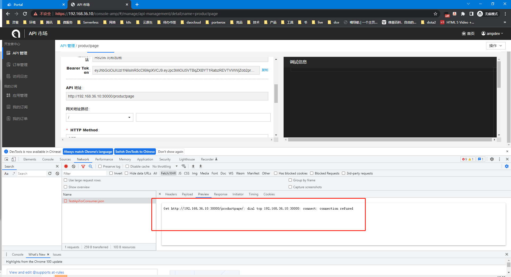

---
kind:
  - Troubleshooting
products:
  - Alauda Container Platform
  - Alauda DevOps
  - Alauda AI
  - Alauda Application Services
  - Alauda Service Mesh
  - Alauda Developer Portal
ProductsVersion:
  - 4.1.0,4.2.x
---
<!-- A type of document that involves encountering a fault, diagnosing it, performing root cause analysis, and providing solutions. -->

# amp api连接拒绝

30000端口连接拒绝 前端无法修改API地址

## Cause
- amp的svc配置externalTrafficPolicy=local导致nodeport无法通过平台vip访问

## Resolution
- 将externalTrafficPolicy更新为cluster

## [workaround]

## [Related Information]
**Screenshots**

- Environment: 3.8.x
- Service
- nodeport
- externalTrafficPolicy
- 30000端口
- Component: (待归类)
- Page ID: 120098569
- Original Title: amp api连接拒绝
