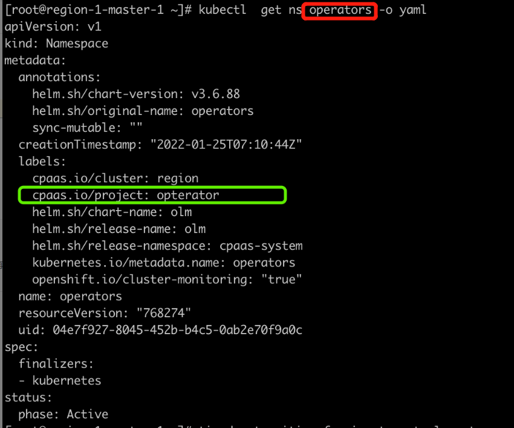

---
kind:
  - Troubleshooting
products:
  - Alauda Container Platform
  - Alauda DevOps
  - Alauda AI
  - Alauda Application Services
  - Alauda Service Mesh
  - Alauda Developer Portal
ProductsVersion:
  - 4.1.0,4.2.x
---
<!-- A type of document that involves encountering a fault, diagnosing it, performing root cause analysis, and providing solutions. -->

# 后台命名空间导入平台界面，通过界面命名空间无法展示

通过界面命名空间无法展示

## Cause
- 命名空间标签拼写错误

## Resolution
- 更新命名空间yaml文件，修正标签信息后重新导入

## [workaround]

## [Related Information]
**Screenshots**

- Environment: 通用
- kubectl get namespaces 命名空间 -oyaml
- 命名空间标签配置
- Component: (待归类)
- Page ID: 120102067
- Original Title: 容器平台-后台命名空间导入平台界面，通过界面命名空间无法展示
