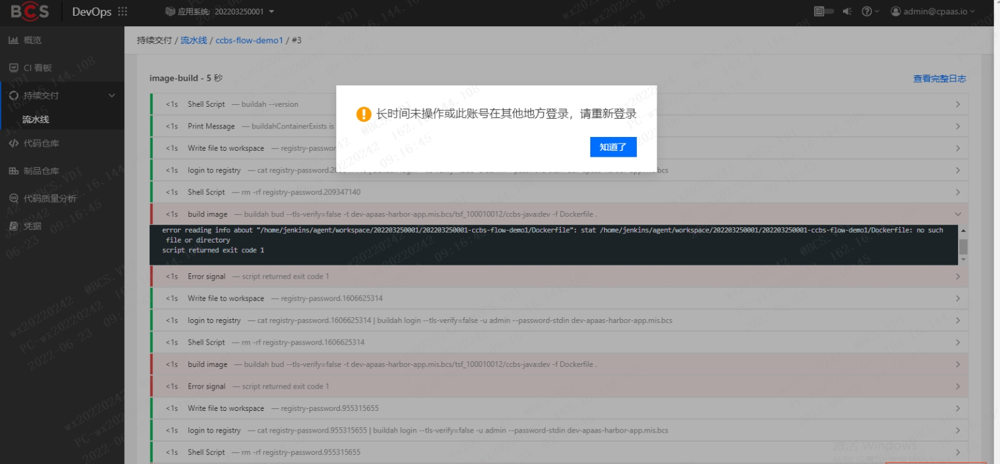
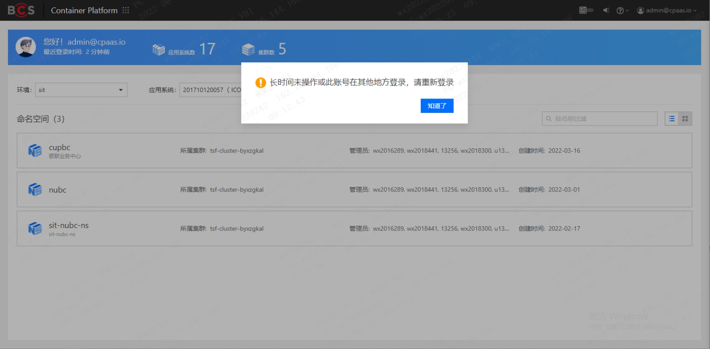
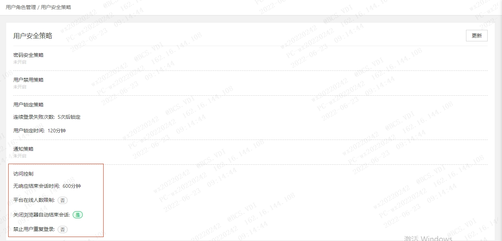
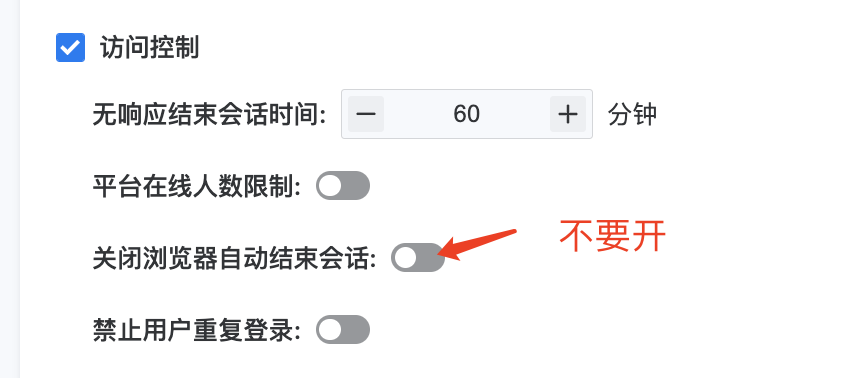

---
kind:
  - Troubleshooting
products:
  - Alauda Container Platform
  - Alauda DevOps
  - Alauda AI
  - Alauda Application Services
  - Alauda Service Mesh
  - Alauda Developer Portal
ProductsVersion:
  - 4.1.0,4.2.x
---
<!-- A type of document that involves encountering a fault, diagnosing it, performing root cause analysis, and providing solutions. -->

# 长时间未操作或此账号在其他地方登录提示请重新登录

登录后频繁掉线 session资源被清理导致超时未到即下线 刚登录成功立即掉线

## Cause
- 浏览器自动结束会话功能开启
- session资源被提前清理

## Resolution
- 执行会话监控命令：kubectl get session -A -w
- 关闭浏览器设置中的'自动结束会话'选项

## [workaround]

## [Related Information]
**Screenshots**

- Environment: TKE 3.6.2及以上版本
- session资源
- kubectl get session
- 浏览器会话设置
- Component: (待归类)
- Page ID: 120102184
- Original Title: 长时间未操作或此账号在其他地方登录提示请重新登录
