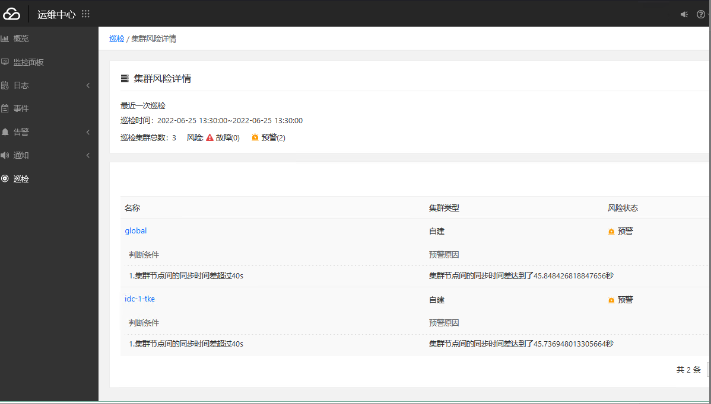

---
kind:
  - Troubleshooting
products:
  - Alauda Container Platform
  - Alauda DevOps
  - Alauda AI
  - Alauda Application Services
  - Alauda Service Mesh
  - Alauda Developer Portal
ProductsVersion:
  - 4.1.0,4.2.x
---
<!-- A type of document that involves encountering a fault, diagnosing it, performing root cause analysis, and providing solutions. -->

# 巡检集群发现时差过大

巡检集群发现时差过大

## Cause
- 宿主机调整时间后，容器内时间未被同步

## Resolution
- 重启global集群cpaas-system名称空间下的couier pod
- 重新执行巡检

## [workaround]

## [Related Information]
**Screenshots**

- Environment: TKE 3.4.2
- couier pod
- cpaas-system
- Component: (待归类)
- Page ID: 120102230
- Original Title: 巡检集群发现时差过大
