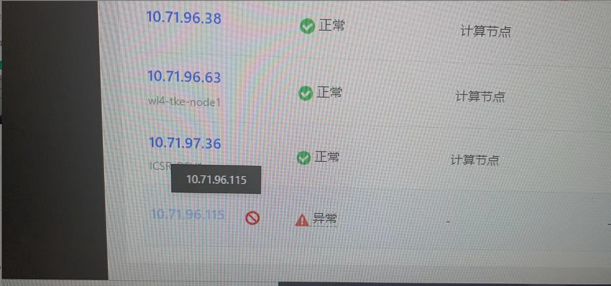
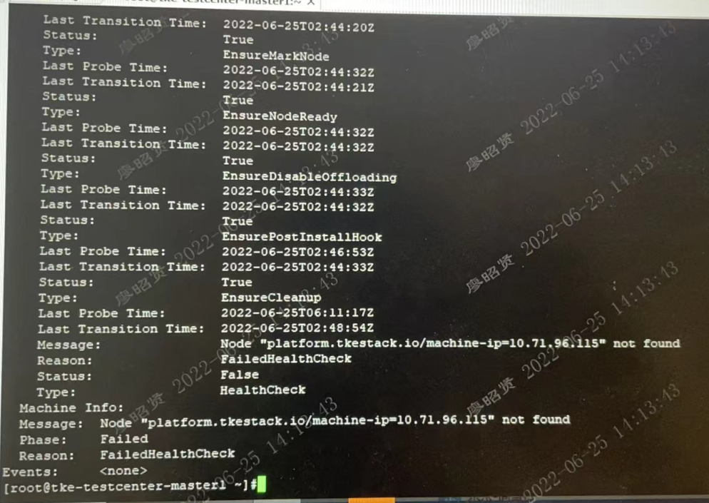

---
kind:
  - Troubleshooting
products:
  - Alauda Container Platform
  - Alauda DevOps
  - Alauda AI
  - Alauda Application Services
  - Alauda Service Mesh
  - Alauda Developer Portal
ProductsVersion:
  - 4.1.0,4.2.x
---
<!-- A type of document that involves encountering a fault, diagnosing it, performing root cause analysis, and providing solutions. -->

# 添加节点界面显示异常

添加节点界面显示异常 global集群machine资源显示节点not found

## Cause
- 首次删除节点时未执行cleanup脚本直接重新加入集群

## Resolution
- 在global集群执行kubectl delete mc [异常的mc资源]
- 在节点执行cleanup脚本后重新加入集群

## [workaround]

## [Related Information]
**Screenshots**

- Environment: TKE 3.4.2
- machine资源(mc)
- cleanup脚本
- global集群
- Component: (待归类)
- Page ID: 120102254
- Original Title: 添加节点界面显示异常
