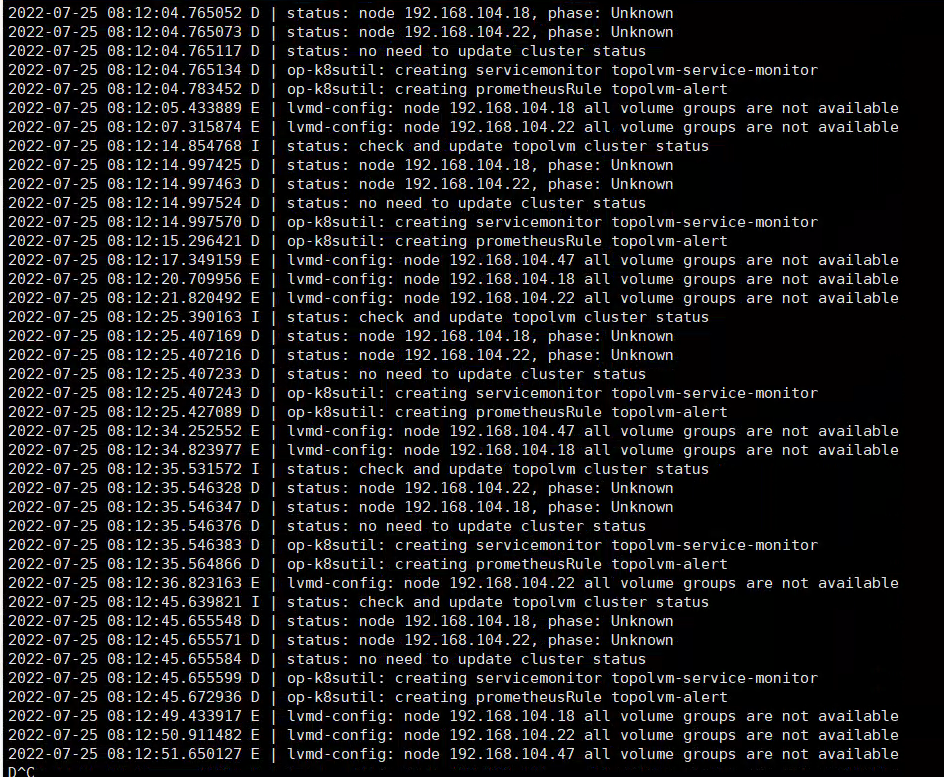

---
kind:
  - Troubleshooting
products:
  - Alauda Container Platform
  - Alauda DevOps
  - Alauda AI
  - Alauda Application Services
  - Alauda Service Mesh
  - Alauda Developer Portal
ProductsVersion:
  - 4.1.0,4.2.x
---
<!-- A type of document that involves encountering a fault, diagnosing it, performing root cause analysis, and providing solutions. -->

# topolvm显示节点不可用

部署到节点vdb、vdc时异常 卸载后重新部署问题依然存在

## Cause
- 未安装lvm2 yum包导致缺少相关命令

## Resolution
- 在不可用节点执行命令：yum install lvm2 -y

## [workaround]

## [Related Information]
**Screenshots**

- Environment: TKE 3.8
- lvm2
- topolvm-operator
- Component: (待归类)
- Page ID: 120117637
- Original Title: topolvm显示节点不可用
