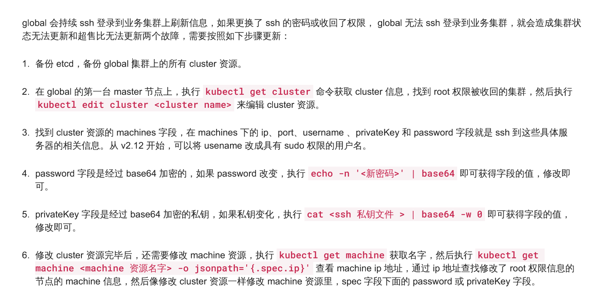

---
kind:
  - Troubleshooting
products:
  - Alauda Container Platform
  - Alauda DevOps
  - Alauda AI
  - Alauda Application Services
  - Alauda Service Mesh
  - Alauda Developer Portal
ProductsVersion:
  - 4.1.0,4.2.x
---
<!-- A type of document that involves encountering a fault, diagnosing it, performing root cause analysis, and providing solutions. -->

# 3.0版本ssh密码变更

需要修改平台密码对应的资源

## Cause
- 检测到SSH弱密码并修改了主机密码

## Resolution
- 按照文档图示步骤更新集群中的SSH密码配置

## [workaround]

## [Related Information]
**Screenshots**

- Environment: 3.0.x
- Component: (待归类)
- Page ID: 120120356
- Original Title: 3.0版本ssh密码变更
