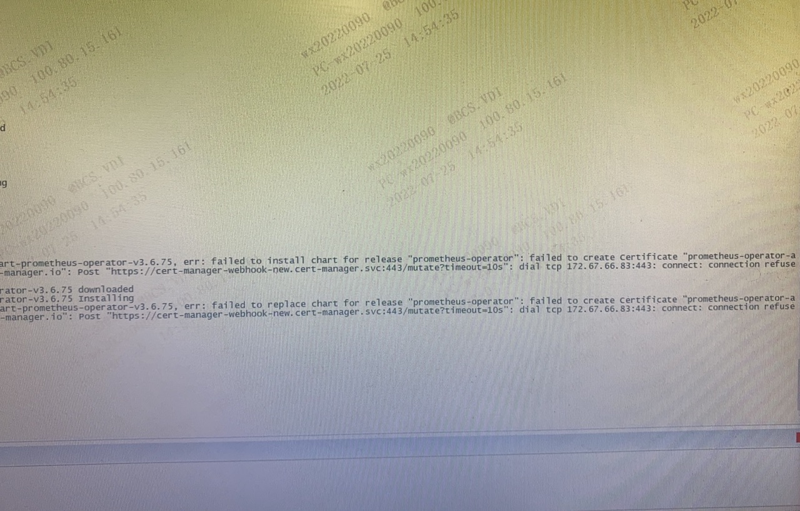
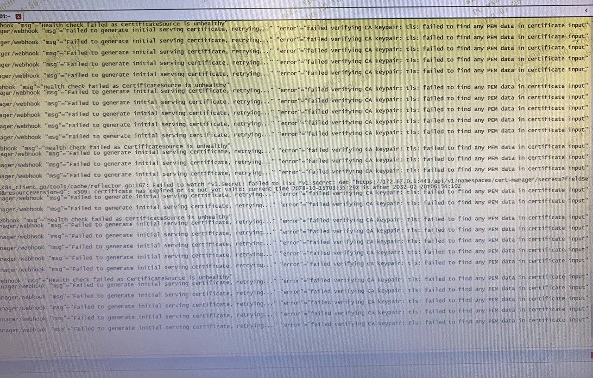

---
kind:
  - Troubleshooting
products:
  - Alauda Container Platform
  - Alauda DevOps
  - Alauda AI
  - Alauda Application Services
  - Alauda Service Mesh
  - Alauda Developer Portal
ProductsVersion:
  - 4.1.0,4.2.x
---
<!-- A type of document that involves encountering a fault, diagnosing it, performing root cause analysis, and providing solutions. -->

# 3.6.2

failed to find any PEM data in certificate input

## Cause

## Resolution
- 重启cert-manager所有的pod

## [workaround]

## [Related Information]
**Screenshots**

- Environment: 通用
- cert-manager
- Component: (待归类)
- Page ID: 120120716
- Original Title: 3.6.2-certmanager异常
