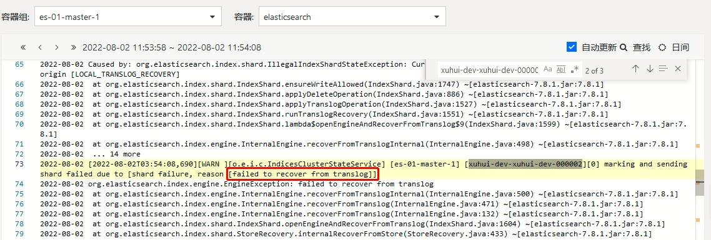
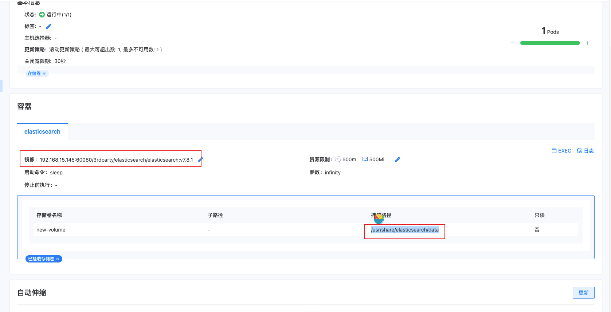
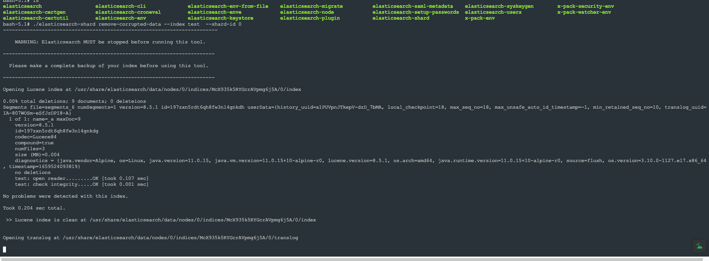

---
kind:
  - Troubleshooting
products:
  - Alauda Container Platform
  - Alauda DevOps
  - Alauda AI
  - Alauda Application Services
  - Alauda Service Mesh
  - Alauda Developer Portal
ProductsVersion:
  - 4.1.0,4.2.x
---
<!-- A type of document that involves encountering a fault, diagnosing it, performing root cause analysis, and providing solutions. -->

# 应用目录ES日志分片故障处理方法

分片状态持续yellow 分片无法正常分配 ES日志显示translog损坏

## Cause
- translog日志损坏导致分片无法分配

## Resolution
- 确认分片所在节点及对应PVC
- 停止ES集群并将副本数置为0
- 使用ES容器镜像启动临时容器，挂载PVC到/usr/share/elasticsearch/data
- 执行命令：/usr/share/elasticsearch/bin/elasticsearch-shard remove-corrupted-data --index <index-name> --shard-id <share-id>
- 重启ES集群并恢复副本数

## [workaround]

## [Related Information]
**Screenshots**

- Environment: 3.8.1
- translog
- elasticsearch-shard工具
- PVC挂载路径/usr/share/elasticsearch/data
- 索引名称
- 分片ID
- Component: (待归类)
- Page ID: 120120917
- Original Title: 应用目录ES日志分片故障处理方法
