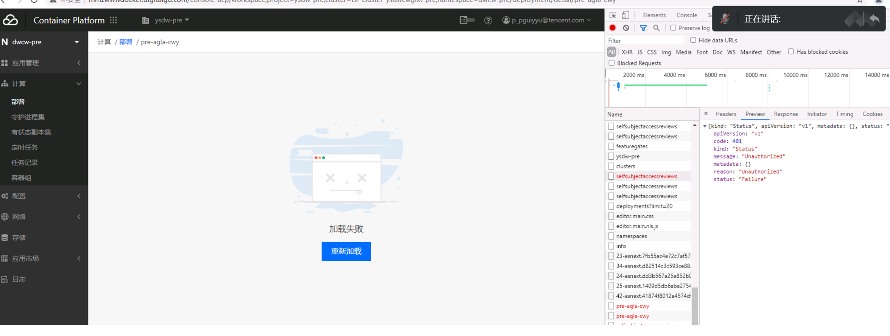

---
kind:
  - Troubleshooting
products:
  - Alauda Container Platform
  - Alauda DevOps
  - Alauda AI
  - Alauda Application Services
  - Alauda Service Mesh
  - Alauda Developer Portal
ProductsVersion:
  - 4.1.0,4.2.x
---
<!-- A type of document that involves encountering a fault, diagnosing it, performing root cause analysis, and providing solutions. -->

# 业务视图

业务视图-部署界面无法加载实例详细信息 F12存在401报错 部分节点业务偶现加载失败

## Cause
- 业务集群部分节点无法解析平台域名
- kube-apiservice服务请求平台域名失败

## Resolution
- 在问题节点/etc/hosts添加平台域名解析
- 重启kube-apiservice容器服务

## [workaround]

## [Related Information]
**Screenshots**

- Environment: 通用
- kube-apiservice
- auth-controller2
- erebus
- icarus
- underlord
- dex
- 平台域名解析
- /etc/hosts
- Component: (待归类)
- Page ID: 120126497
- Original Title: 容器平台-业务视图-单个项目下部署界面无法加载实例详细信息，报错加载失败，f12查看存在401报错
