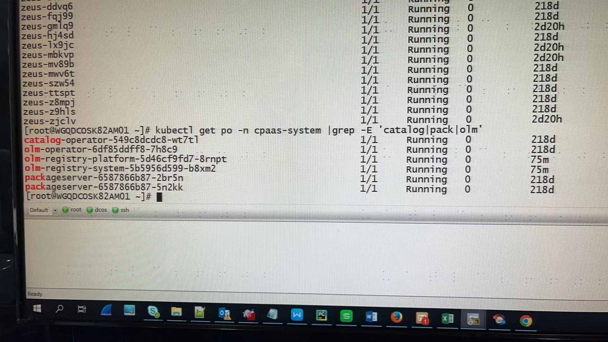

---
kind:
  - Troubleshooting
products:
  - Alauda Container Platform
  - Alauda DevOps
  - Alauda AI
  - Alauda Application Services
  - Alauda Service Mesh
  - Alauda Developer Portal
ProductsVersion:
  - 4.1.0,4.2.x
---
<!-- A type of document that involves encountering a fault, diagnosing it, performing root cause analysis, and providing solutions. -->

# operator界面显示无可用的operator

operator界面显示无可用的operator olm相关容器正常运行 catalog和library资源存在

## Cause
- artifactVersion资源同步状态异常

## Resolution
- 手动更新artifactVersion字段触发重新同步：
kubectl proxy &

export ArtifactName=$(kubectl get artifact -A -l source!=charts | awk '{if($2!="NAME")  print $2}')

for name in $ArtifactName;
do
    curl -k -s -X PATCH -H "Accept: application/json, */*" \
    -H "Content-Type: application/merge-patch+json" \
    127.0.0.1:8001/apis/app.alauda.io/v1alpha1/namespaces/cpaas-system/artifacts/${name}/status \
    --data '{"status":{"synced":false}}'
done

## [workaround]

## [Related Information]
**Screenshots**

- Environment: 3.6.2
- artifactVersion
- catalog
- library
- olm
- Component: (待归类)
- Page ID: 123601532
- Original Title: operator界面显示无可用的operator
