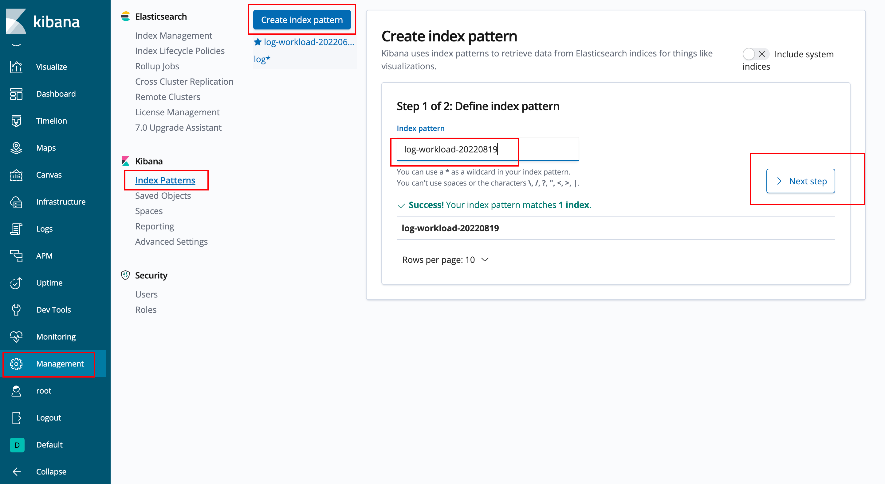
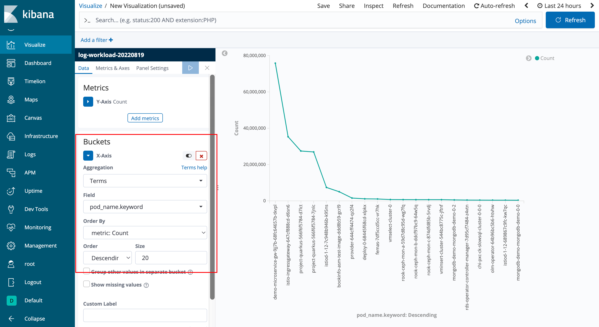

---
kind:
  - Troubleshooting
products:
  - Alauda Container Platform
  - Alauda DevOps
  - Alauda AI
  - Alauda Application Services
  - Alauda Service Mesh
  - Alauda Developer Portal
ProductsVersion:
  - 4.1.0,4.2.x
---
<!-- A type of document that involves encountering a fault, diagnosing it, performing root cause analysis, and providing solutions. -->

# 如何查看平台日志中心容器日志存储最多的top10

日志增长激增

## Cause

## Resolution
- 登陆kibana创建index pattern
- 创建Line类型可视化图表
- X坐标使用Terms聚合pod_name.keyword字段

## [workaround]

## [Related Information]
**Screenshots**

- Environment: 3.4,3.6,3.8
- kibana
- Management
- Visualize
- pod_name.keyword
- Kibana Index Patterns
- Component: (待归类)
- Page ID: 123606227
- Original Title: 如何查看平台日志中心容器日志存储最多的top10
