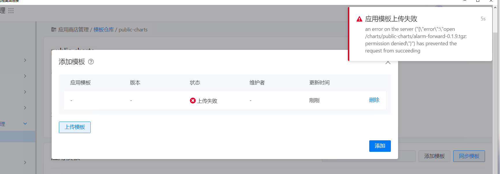

---
kind:
  - Troubleshooting
products:
  - Alauda Container Platform
  - Alauda DevOps
  - Alauda AI
  - Alauda Application Services
  - Alauda Service Mesh
  - Alauda Developer Portal
ProductsVersion:
  - 4.1.0,4.2.x
---
<!-- A type of document that involves encountering a fault, diagnosing it, performing root cause analysis, and providing solutions. -->

# 3.8上传chart至public仓库报错应用模板上传失败

应用模板上传失败 an error on the server ("error)": )"open /charts/public-charts/alarm-forward-0.1.9.tgz: permission denied\") has prevented the request from succeeding

## Cause
- /cpaas/captain-chartmuseum/目录权限为755(需要777权限)

## Resolution
- chmod 777 /cpaas/captain-chartmuseum/

## [workaround]

## [Related Information]
**Screenshots**

- Environment: 3.8.2
- /cpaas/captain-chartmuseum/
- public-charts
- chartmuseum容器
- hostpath volume
- Component: (待归类)
- Page ID: 124687417
- Original Title: 3.8上传chart至public仓库报错应用模板上传失败
