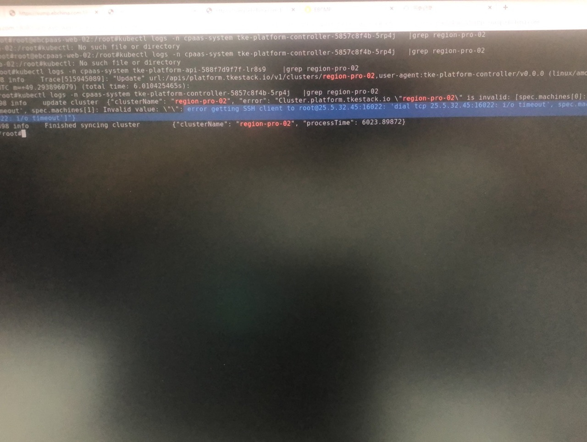

---
kind:
  - Troubleshooting
products:
  - Alauda Container Platform
  - Alauda DevOps
  - Alauda AI
  - Alauda Application Services
  - Alauda Service Mesh
  - Alauda Developer Portal
ProductsVersion:
  - 4.1.0,4.2.x
---
<!-- A type of document that involves encountering a fault, diagnosing it, performing root cause analysis, and providing solutions. -->

# 2.9.2

业务集群状态异常 集群内pod为running,无启动失败pod

## Cause
- tke-platform-controller组件状态未正确更新或存在临时故障

## Resolution
- 重启tke-platform-controller组件

## [workaround]

## [Related Information]
**Screenshots**

- Environment: 2.9.2
- tke-platform-controller
- Component: (待归类)
- Page ID: 124696595
- Original Title: 2.9.2-基础架构-业务集群状态异常
