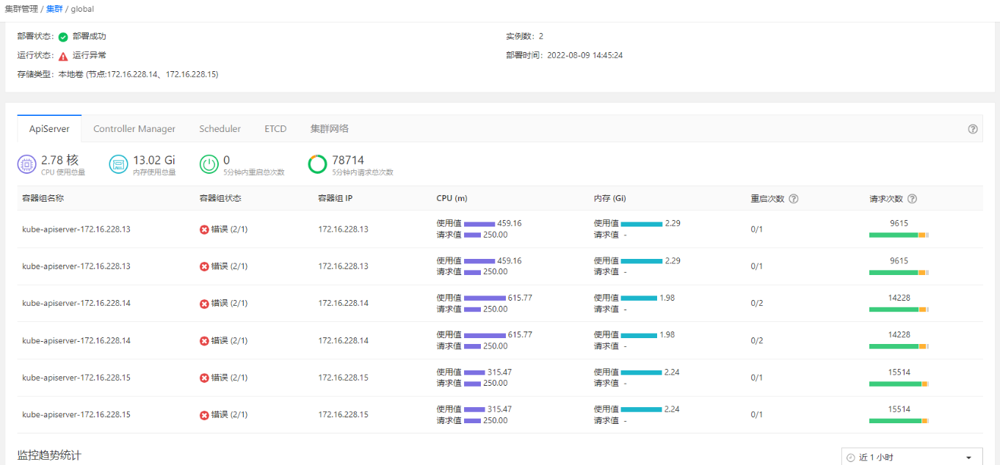

---
kind:
  - Troubleshooting
products:
  - Alauda Container Platform
  - Alauda DevOps
  - Alauda AI
  - Alauda Application Services
  - Alauda Service Mesh
  - Alauda Developer Portal
ProductsVersion:
  - 4.1.0,4.2.x
---
<!-- A type of document that involves encountering a fault, diagnosing it, performing root cause analysis, and providing solutions. -->

# 3.6.3

global集群监控异常 部分pod运行异常

## Cause
- 存在多个版本的ReplicaSet资源残留导致部分pod异常

## Resolution
- 清理遗留的ReplicaSet资源
- 删除节点上退出的容器

## [workaround]

## [Related Information]
**Screenshots**
global集群监控异常
- Environment: 3.6.3
- ReplicaSet
- pod
- 监控组件
- Component: (待归类)
- Page ID: 124696656
- Original Title: 3.6.3-基础架构-可视化运维-global集群监控异常
