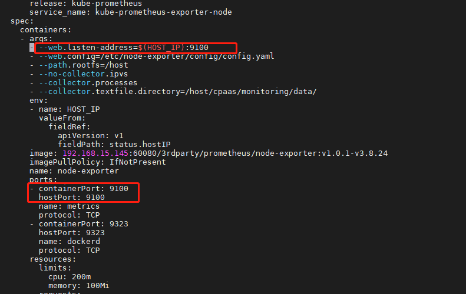

---
kind:
  - Troubleshooting
products:
  - Alauda Container Platform
  - Alauda DevOps
  - Alauda AI
  - Alauda Application Services
  - Alauda Service Mesh
  - Alauda Developer Portal
ProductsVersion:
  - 4.1.0,4.2.x
---
<!-- A type of document that involves encountering a fault, diagnosing it, performing root cause analysis, and providing solutions. -->

# 3.8修改node

需要修改node-exporter默认9100端口

## Cause
- 默认端口9100需要变更

## Resolution
- 执行命令修改DaemonSet配置：kubectl edit ds -n cpaas-system kube-prometheus-exporter-node
- 在DaemonSet中找到3处9100端口配置并修改为新端口

## [workaround]

## [Related Information]
**Screenshots**

- Environment: 3.6（待验证） 3.8
- 9100
- cpaas-system
- kube-prometheus-exporter-node
- DaemonSet
- Component: (待归类)
- Page ID: 124700689
- Original Title: 3.8修改node-export端口
