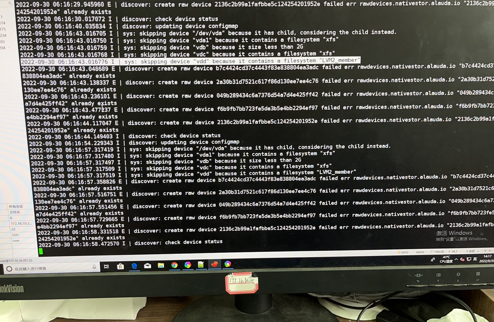

---
kind:
  - Troubleshooting
products:
  - Alauda Container Platform
  - Alauda DevOps
  - Alauda AI
  - Alauda Application Services
  - Alauda Service Mesh
  - Alauda Developer Portal
ProductsVersion:
  - 4.1.0,4.2.x
---
<!-- A type of document that involves encountering a fault, diagnosing it, performing root cause analysis, and providing solutions. -->

# topolvm界面添加磁盘设备不识别

界面无法识别磁盘设备 discover日志提示存在文件系统 lsblk显示FSTYPE为LVM2_member

## Cause
- 磁盘残留LVM元数据或分区表信息
- 系统误判存在文件系统

## Resolution
- 使用fdisk创建新分区表并建立分区
- 执行完整擦除操作：dd if=/dev/zero of=/dev/vdd bs=4k count=512
- 清除文件系统签名：wipefs -af /dev/vdd
- 删除所有GPT数据结构：sgdisk --zap-all /dev/vdd

## [workaround]

## [Related Information]
**Screenshots**

- Environment: 3.8.x
- /dev/vdd
- LVM2_member
- discover-xxx日志
- fdisk
- wipefs
- sgdisk
- dd
- Component: (待归类)
- Page ID: 127408942
- Original Title: topolvm界面添加磁盘设备不识别
