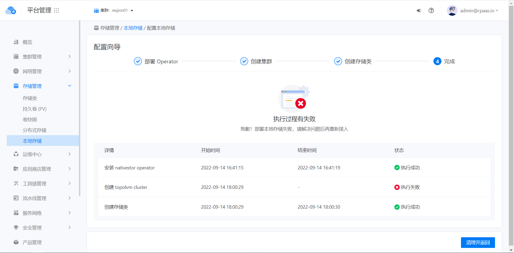
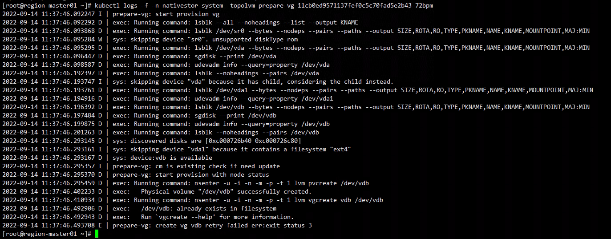

---
kind:
  - Troubleshooting
products:
  - Alauda Container Platform
  - Alauda DevOps
  - Alauda AI
  - Alauda Application Services
  - Alauda Service Mesh
  - Alauda Developer Portal
ProductsVersion:
  - 4.1.0,4.2.x
---
<!-- A type of document that involves encountering a fault, diagnosing it, performing root cause analysis, and providing solutions. -->

# 3.8.2

创建topolvm失败，无法选择本地磁盘 部署失败，topolvm组件无法下载镜像 重新部署后异常，节点prepare pod设备名称错误

## Cause
- 磁盘内有脏数据
- setting文件内版本错误导致镜像下载错误
- 设备名称与磁盘同名（如vdb）

## Resolution
- 执行 dd if=/dev/zero of=/dev/vdb bs=4k count=512 清理磁盘
- 删除nativestor-system命名空间下的nativestor-setting ConfigMap、topolvm-operator Subscription及topolvmcluster后重新部署
- 修改设备名称不与磁盘同名（如改为sshd）

## [workaround]

## [Related Information]
**Screenshots**
2、继续部署还是失败,发现topolvm组件无法下载镜像,因为setting文件内版本错误导致下载错误镜像,删除命名空间nativestor-system下名为nativestor-setting的configmap,删除Subscription下名为topolvm-operator的资源,删除topolvmcluster后重新部署,nativestor-setting内的镜像版本正确(举例topolvm:v3.8.0-huawei-isdp.4)
3、重新部署后还是异常,检查节点prepare pod发现设备名称填写错误,不能和磁盘同名
- Environment: 3.8.2
- /dev/vdb
- nativestor-system命名空间
- nativestor-setting ConfigMap
- Subscription资源
- topolvm-operator
- topolvmcluster
- Component: (待归类)
- Page ID: 127409153
- Original Title: 3.8.2-容器平台-创建topolvm绑定本地存储盘失败
