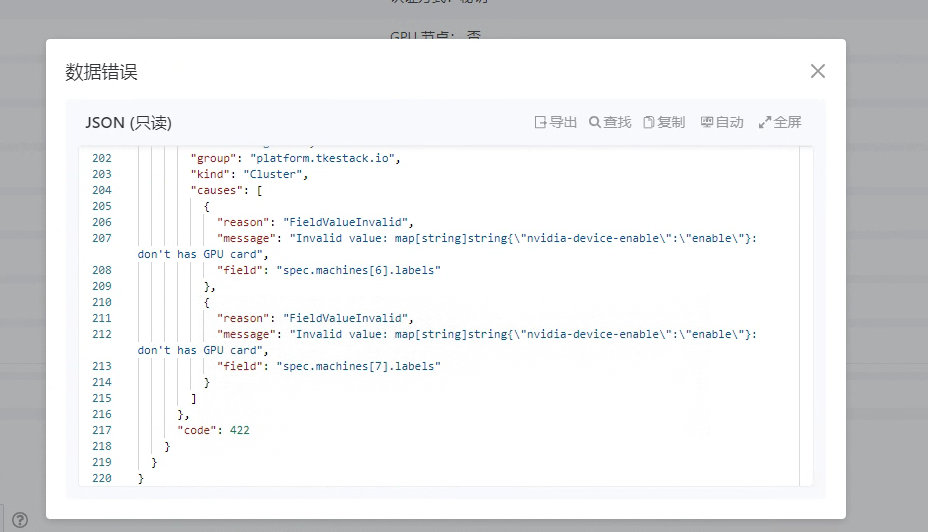

---
kind:
  - Troubleshooting
products:
  - Alauda Container Platform
  - Alauda DevOps
  - Alauda AI
  - Alauda Application Services
  - Alauda Service Mesh
  - Alauda Developer Portal
ProductsVersion:
  - 4.1.0,4.2.x
---
<!-- A type of document that involves encountering a fault, diagnosing it, performing root cause analysis, and providing solutions. -->

# 添加gpu节点可用性检查失败

添加GPU节点时节点可用性检查报错：dont has GPU hard

## Cause
- 节点缺少lspci命令导致无法获取GPU卡信息

## Resolution
- yum install -y pciutils 安装lspci命令

## [workaround]

## [Related Information]
**Screenshots**

- Environment: 通用
- lspci
- pciutils
- 3d|display|vga
- Component: (待归类)
- Page ID: 127423420
- Original Title: 添加gpu节点可用性检查失败
