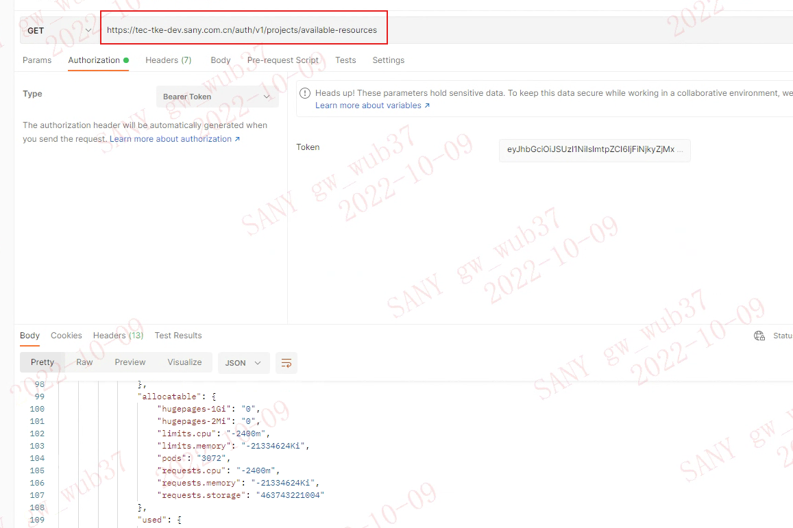
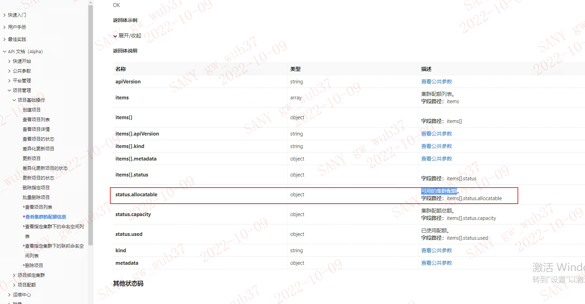

---
kind:
  - Troubleshooting
products:
  - Alauda Container Platform
  - Alauda DevOps
  - Alauda AI
  - Alauda Application Services
  - Alauda Service Mesh
  - Alauda Developer Portal
ProductsVersion:
  - 4.1.0,4.2.x
---
<!-- A type of document that involves encountering a fault, diagnosing it, performing root cause analysis, and providing solutions. -->

# 使用平台项目管理api访问查看集群配合显示异常

部分集群的可分配额（allocatable）显示为负数

## Cause
- 项目配额（used）设置值大于集群实际可用资源（capacity）

## Resolution
- 调整项目配额配置使其小于等于集群实际资源
- 或扩容集群物理资源

## [workaround]

## [Related Information]
**Screenshots**

- Environment: 3.4.2
- /auth/v1/projects/available-resources
- used
- capacity
- allocatable
- 项目配额
- Component: (待归类)
- Page ID: 127427981
- Original Title: 使用平台项目管理api访问查看集群配合显示异常
