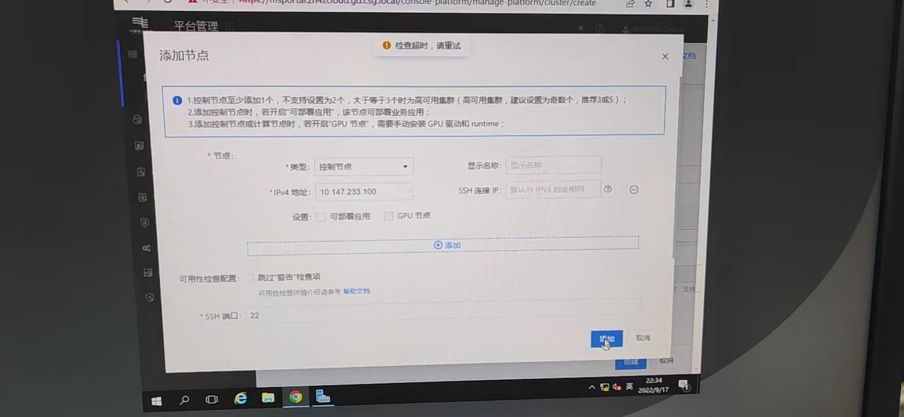

---
kind:
  - Troubleshooting
products:
  - Alauda Container Platform
  - Alauda DevOps
  - Alauda AI
  - Alauda Application Services
  - Alauda Service Mesh
  - Alauda Developer Portal
ProductsVersion:
  - 4.1.0,4.2.x
---
<!-- A type of document that involves encountering a fault, diagnosing it, performing root cause analysis, and providing solutions. -->

# 业务集群创建失败,界面报错检查超时

业务集群创建失败，界面报错检查超时 接口返回错误：json: cannot unmarshal string into Go struct field ThirdPartyHA.cluster.spec.features.ha.thirdParty.vport of type int32

## Cause
- 集群地址的端口值被添加引号导致类型校验失败（字符串无法转为int32）
- 中文输入法输入端口导致数值被引号包裹

## Resolution
- 使用英文输入法重新输入端口数值（确保端口值无引号）

## [workaround]

## [Related Information]
**Screenshots**

- Environment: 3.6.2
- ThirdPartyHA.cluster.spec.features.ha.thirdParty.vport
- 6443
- Component: (待归类)
- Page ID: 127428314
- Original Title: 业务集群创建失败,界面报错检查超时
