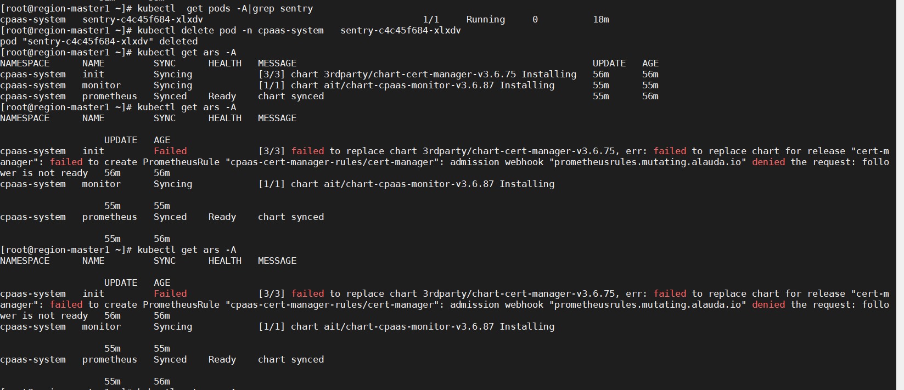

---
kind:
  - Troubleshooting
products:
  - Alauda Container Platform
  - Alauda DevOps
  - Alauda AI
  - Alauda Application Services
  - Alauda Service Mesh
  - Alauda Developer Portal
ProductsVersion:
  - 4.1.0,4.2.x
---
<!-- A type of document that involves encountering a fault, diagnosing it, performing root cause analysis, and providing solutions. -->

# 平台部署

业务集群部署失败 prometheus-adapter 组件持续崩溃（CrashLoopBackOff） init apprelease 部署停滞

## Cause
- monitor 组件过早部署
- 依赖组件 cluster-base 未完成部署

## Resolution
- 创建业务集群时不勾选监控部署选项
- 集群安装成功后通过独立流程部署监控组件

## [workaround]

## [Related Information]
**Screenshots**

- Environment: 3.6, 3.6.1, 3.6.2
- prometheus-adapter
- cluster-base
- init apprelease
- 监控组件
- Component: (待归类)
- Page ID: 127429296
- Original Title: 平台部署-3.6-创建业务集群时选择部署监控组件集群部署失败
