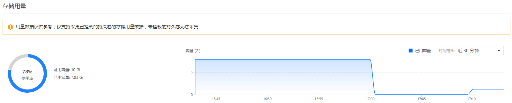
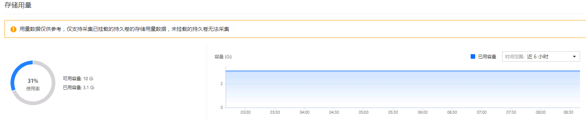

---
kind:
  - Troubleshooting
products:
  - Alauda Container Platform
  - Alauda DevOps
  - Alauda AI
  - Alauda Application Services
  - Alauda Service Mesh
  - Alauda Developer Portal
ProductsVersion:
  - 4.1.0,4.2.x
---
<!-- A type of document that involves encountering a fault, diagnosing it, performing root cause analysis, and providing solutions. -->

# pvc存储用量使用率问题

清理pvc中存储数据后存储用量使用率未有变化

## Cause
- pvc存储用量使用率是根据查询时间范围内取最大值的计算结果

## Resolution
- 调整查询时间范围或等待系统重新计算最大值

## [workaround]

## [Related Information]
**Screenshots**

- Environment: 3.0-3.10.0
- pvc监控指标
- 存储用量计算逻辑
- Component: (待归类)
- Page ID: 127429512
- Original Title: pvc存储用量使用率问题
