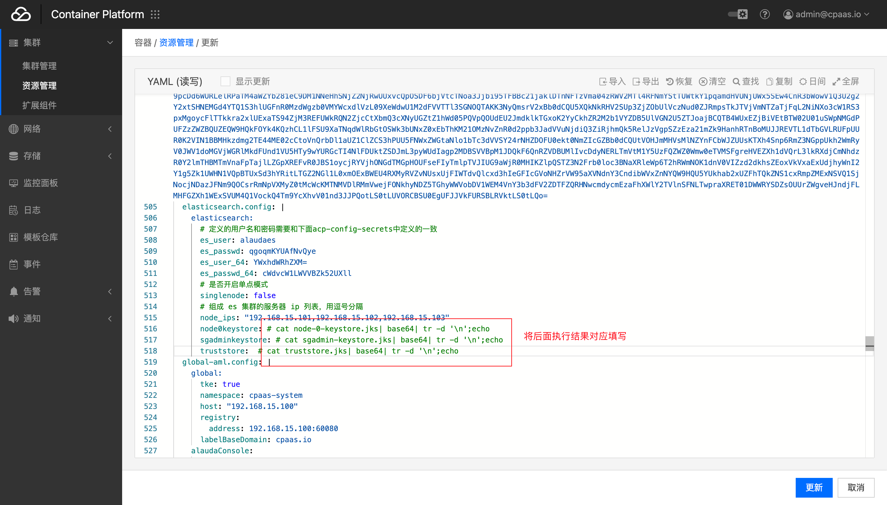

---
kind:
  - Troubleshooting
products:
  - Alauda Container Platform
  - Alauda DevOps
  - Alauda AI
  - Alauda Application Services
  - Alauda Service Mesh
  - Alauda Developer Portal
ProductsVersion:
  - 4.1.0,4.2.x
---
<!-- A type of document that involves encountering a fault, diagnosing it, performing root cause analysis, and providing solutions. -->

# 应用状态显示失败

应用状态显示失败 实际selector的deployment资源正常 pod状态Running

## Cause
- application的assemblyPhase状态异常

## Resolution
- 手动修改状态失败的application的assemblyPhase状态

## [workaround]

## [Related Information]
**Screenshots**

- Environment: TKE 3.4.2
- archon组件
- application资源
- deployment资源
- assemblyPhase
- Component: (待归类)
- Page ID: 127429976
- Original Title: 应用状态显示失败
