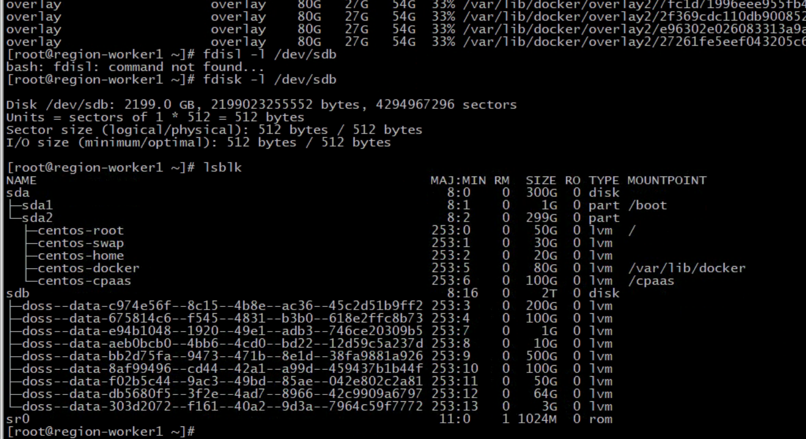
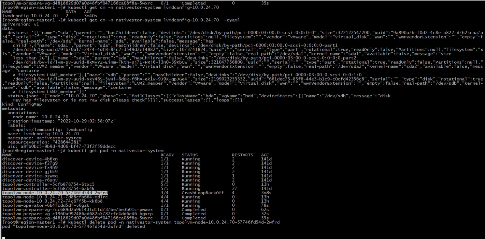
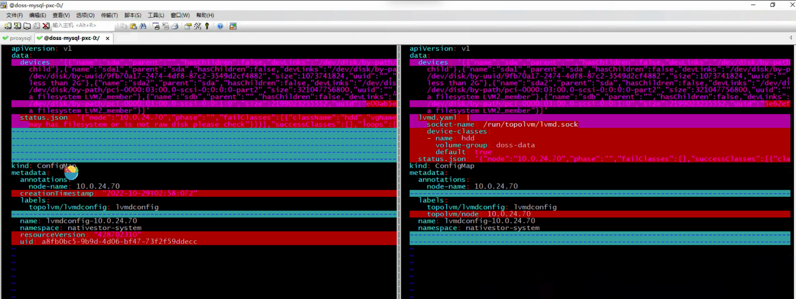

---
kind:
  - Troubleshooting
products:
  - Alauda Container Platform
  - Alauda DevOps
  - Alauda AI
  - Alauda Application Services
  - Alauda Service Mesh
  - Alauda Developer Portal
ProductsVersion:
  - 4.1.0,4.2.x
---
<!-- A type of document that involves encountering a fault, diagnosing it, performing root cause analysis, and providing solutions. -->

# 节点重启后topolvm本地存储故障

lvmd容器组报错: should have at least one device-class 节点重启后topolvm-node无法正常启动

## Cause
- 节点扩容磁盘操作导致lvmd的ConfigMap中devices信息丢失

## Resolution
- 补全异常节点ConfigMap的devices配置信息
- 重启topolvm-node组件

## [workaround]

## [Related Information]
**Screenshots**

- Environment: 3.8.1
- /etc/topolvm/lvmd.yaml
- /run/topolvm/lvmd.sock
- lvmd
- topolvm-node
- device-class
- Component: (待归类)
- Page ID: 127432373
- Original Title: 节点重启后topolvm本地存储故障
