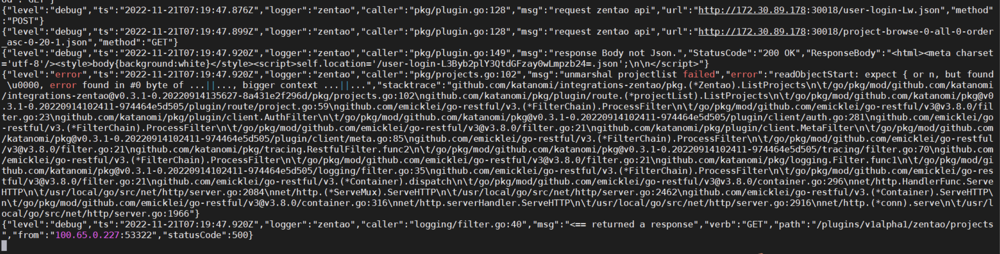
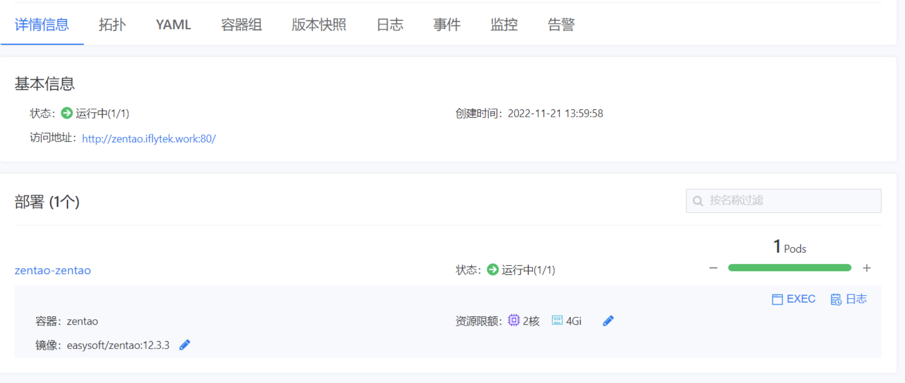
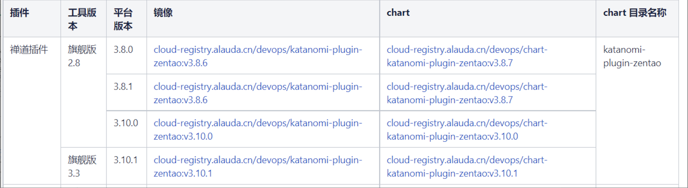

---
kind:
  - Troubleshooting
products:
  - Alauda Container Platform
  - Alauda DevOps
  - Alauda AI
  - Alauda Application Services
  - Alauda Service Mesh
  - Alauda Developer Portal
ProductsVersion:
  - 4.1.0,4.2.x
---
<!-- A type of document that involves encountering a fault, diagnosing it, performing root cause analysis, and providing solutions. -->

# 禅道集成后不显示数据

禅道集成后不显示数据 katanomi plugin pod日志显示处理zentao请求反序列化失败

## Cause
- zentao使用的版本是非TKE兼容版本

## Resolution
- 更换为平台支持的禅道版本

## [workaround]

## [Related Information]
**Screenshots**

- Environment: TKE 3.8
- katanomi plugin
- zentao版本
- TKE兼容性
- Component: (待归类)
- Page ID: 130566085
- Original Title: 禅道集成后不显示数据
