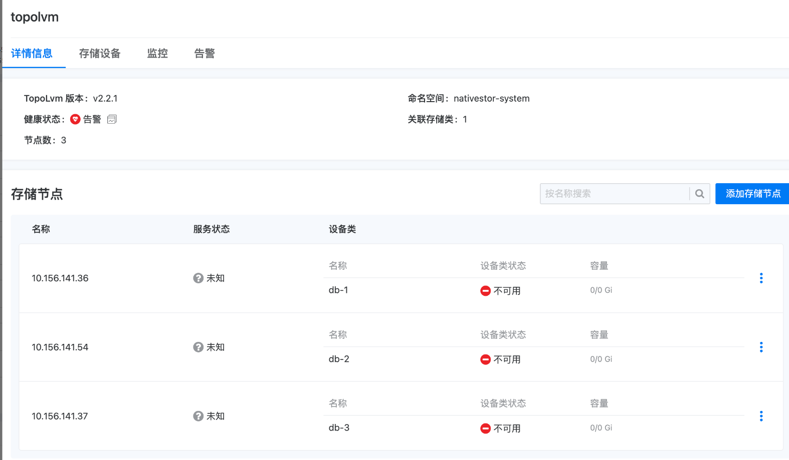
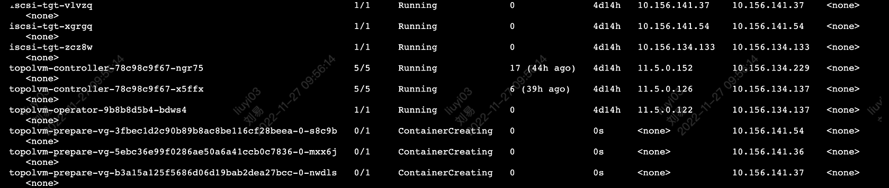
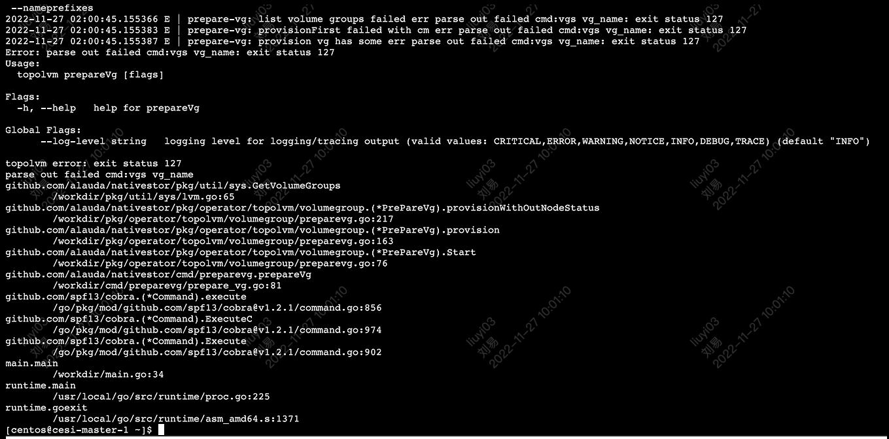

---
kind:
  - Troubleshooting
products:
  - Alauda Container Platform
  - Alauda DevOps
  - Alauda AI
  - Alauda Application Services
  - Alauda Service Mesh
  - Alauda Developer Portal
ProductsVersion:
  - 4.1.0,4.2.x
---
<!-- A type of document that involves encountering a fault, diagnosing it, performing root cause analysis, and providing solutions. -->

# 3.8

创建vg的任务动作一直在删除重建 执行pvs、vgs等命令时发现lvm命令未安装

## Cause
- lvm基础命令未安装

## Resolution
- yum install lvm2

## [workaround]

## [Related Information]
**Screenshots**

- Environment: 通用
- vg
- pvs
- vgs
- Component: (待归类)
- Page ID: 130577374
- Original Title: 3.8-安装topolvm节点状态异常-lvm基础命令未安装
