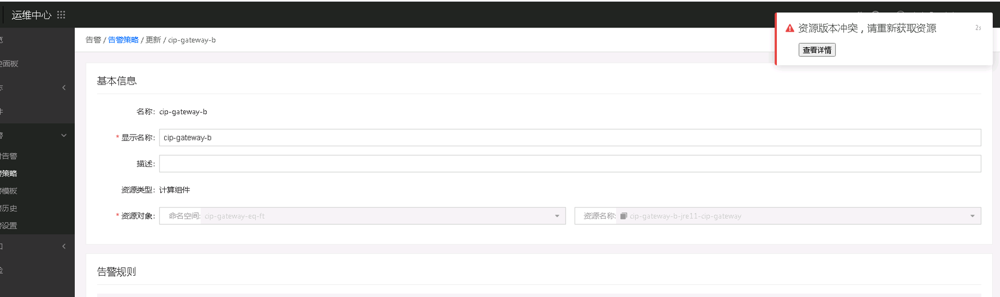

---
kind:
  - Troubleshooting
products:
  - Alauda Container Platform
  - Alauda DevOps
  - Alauda AI
  - Alauda Application Services
  - Alauda Service Mesh
  - Alauda Developer Portal
ProductsVersion:
  - 4.1.0,4.2.x
---
<!-- A type of document that involves encountering a fault, diagnosing it, performing root cause analysis, and providing solutions. -->

# 更改监控策略，点击更新后，有弹窗告警

点击更新监控策略后出现弹窗告警 告警内容显示该告警already exists

## Cause
- 策略处于告警状态时不可更改

## Resolution
- 等待策略恢复告警状态解除后修改
- 关闭该策略后进行修改

## [workaround]

## [Related Information]
**Screenshots**

- Environment: 通用版本
- 告警策略
- Component: (待归类)
- Page ID: 133074339
- Original Title: 更改监控策略，点击更新后，有弹窗告警
