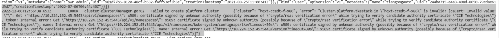
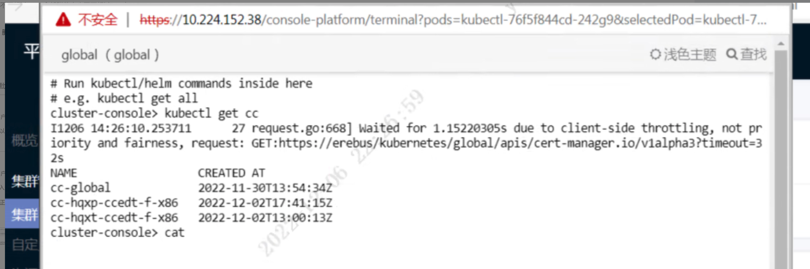

---
kind:
  - Troubleshooting
products:
  - Alauda Container Platform
  - Alauda DevOps
  - Alauda AI
  - Alauda Application Services
  - Alauda Service Mesh
  - Alauda Developer Portal
ProductsVersion:
  - 4.1.0,4.2.x
---
<!-- A type of document that involves encountering a fault, diagnosing it, performing root cause analysis, and providing solutions. -->

# CCE无法接入集群

x509 认证失败

## Cause
- 集群接入后因异常删除导致clustercredentials资源未正常回收

## Resolution
- 删除该集群的clustercredentials资源后重新部署cce信息同步插件

## [workaround]

## [Related Information]
**Screenshots**

- Environment: v3.8.1-cce.rc.22
- clustercredentials
- cce信息同步插件
- Component: (待归类)
- Page ID: 133074927
- Original Title: CCE无法接入集群
