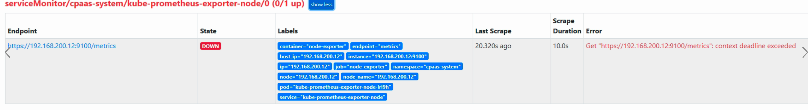
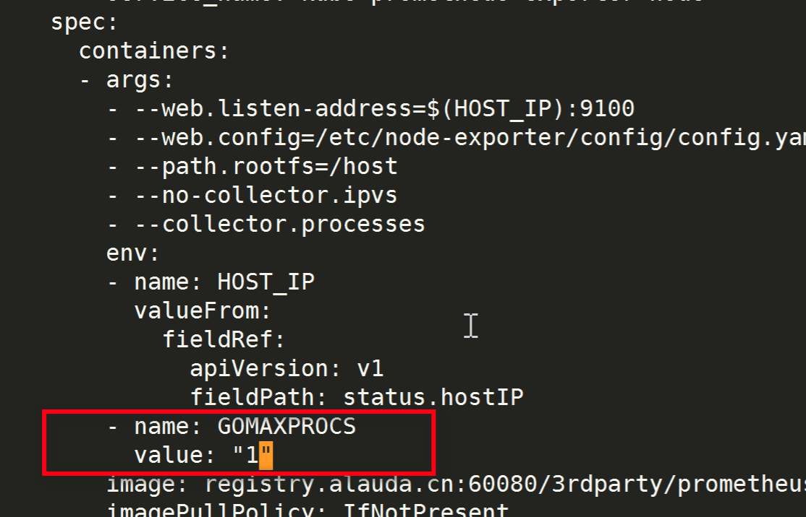

---
kind:
  - Troubleshooting
products:
  - Alauda Container Platform
  - Alauda DevOps
  - Alauda AI
  - Alauda Application Services
  - Alauda Service Mesh
  - Alauda Developer Portal
ProductsVersion:
  - 4.1.0,4.2.x
---
<!-- A type of document that involves encountering a fault, diagnosing it, performing root cause analysis, and providing solutions. -->

# exporter

metrics请求返回很慢 exporter-node日志报错: write tcp ...: write: broken pipe

## Cause
- Ubuntu系统下exporter-node组件可能因GOMAXPROCS设置不当导致资源争用

## Resolution
- 给kube-prometheus-exporter-node增加环境变量: name: GOMAXPROCS, value: "1"

## [workaround]
- 同resolution方案

## [Related Information]
**Screenshots**

- Environment: Ubuntu 20.04.5 LTS (内核5.4.0-132-generic), 平台版本3.10.1
- 9100端口
- GOMAXPROCS环境变量
- kube-prometheus-exporter-node组件
- Component: (待归类)
- Page ID: 133075339
- Original Title: exporter-node异常导致触发节点状态异常告警
