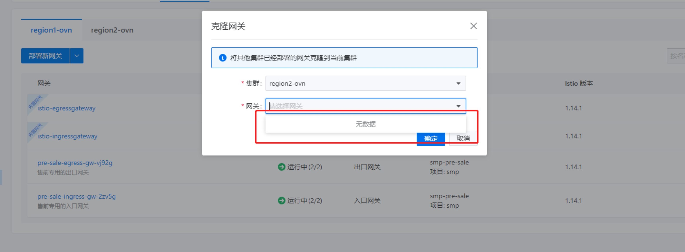

---
kind:
  - Troubleshooting
products:
  - Alauda Container Platform
  - Alauda DevOps
  - Alauda AI
  - Alauda Application Services
  - Alauda Service Mesh
  - Alauda Developer Portal
ProductsVersion:
  - 4.1.0,4.2.x
---
<!-- A type of document that involves encountering a fault, diagnosing it, performing root cause analysis, and providing solutions. -->

# 克隆网关下拉无数据

克隆网关下拉无可克隆网关

## Cause
- 两个集群没有同名命名空间

## Resolution
- 创建同名ns后克隆正常

## [workaround]

## [Related Information]
**Screenshots**

- Environment: 3.10.1
- 命名空间名称
- 网关克隆功能
- 多集群服务网格
- Component: (待归类)
- Page ID: 133075976
- Original Title: 克隆网关下拉无数据
