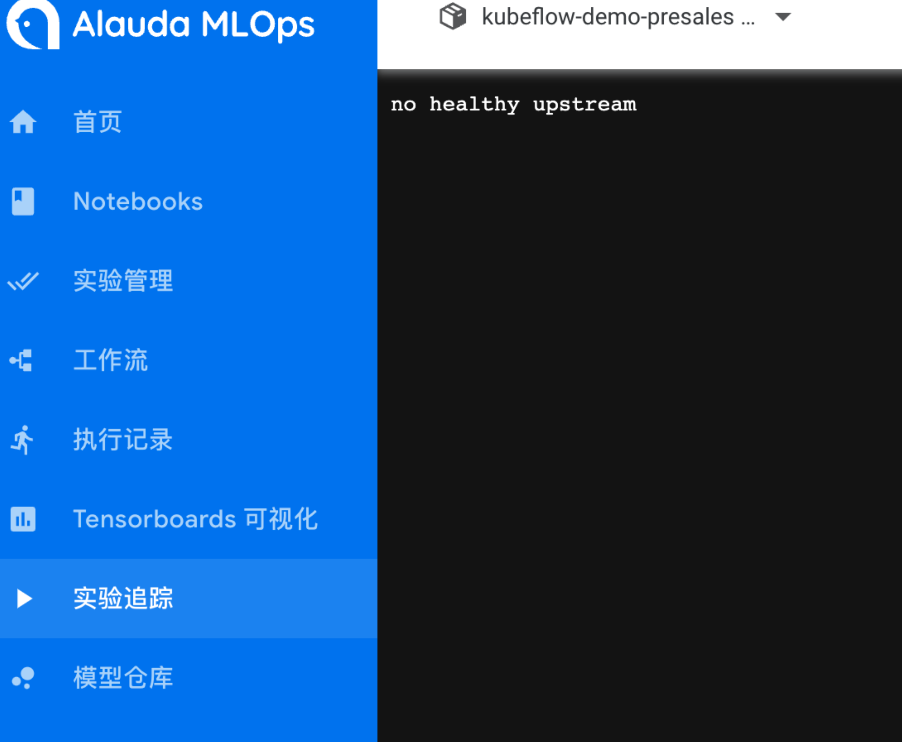
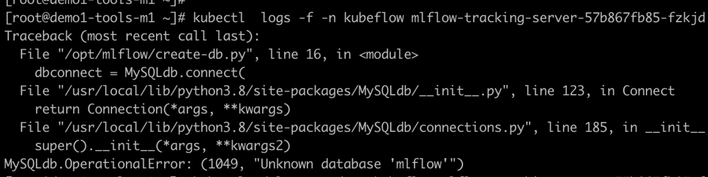

---
kind:
  - Troubleshooting
products:
  - Alauda Container Platform
  - Alauda DevOps
  - Alauda AI
  - Alauda Application Services
  - Alauda Service Mesh
  - Alauda Developer Portal
ProductsVersion:
  - 4.1.0,4.2.x
---
<!-- A type of document that involves encountering a fault, diagnosing it, performing root cause analysis, and providing solutions. -->

# kubeflow下mlflow无法启动

mlflow无法启动，页面实验追踪反馈：no healthy upstream 日志反馈找不到库 mlflow

## Cause
- 数据库未创建导致mlflow-tracking-server初始化失败

## Resolution
- 手动在数据库中创建mlflow数据库
- 重建mlflow-tracking-server pod

## [workaround]

## [Related Information]
**Screenshots**

- Environment: kubeflow
- mlflow-tracking-server
- mlflow数据库
- Component: (待归类)
- Page ID: 133075987
- Original Title: kubeflow下mlflow无法启动
