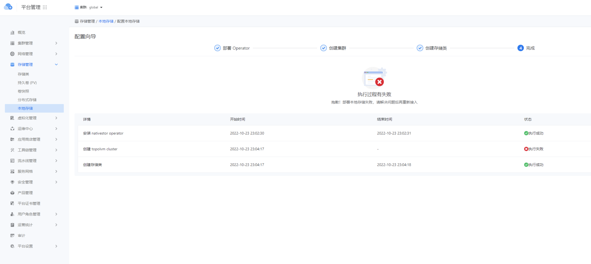

---
kind:
  - Troubleshooting
products:
  - Alauda Container Platform
  - Alauda DevOps
  - Alauda AI
  - Alauda Application Services
  - Alauda Service Mesh
  - Alauda Developer Portal
ProductsVersion:
  - 4.1.0,4.2.x
---
<!-- A type of document that involves encountering a fault, diagnosing it, performing root cause analysis, and providing solutions. -->

# 本地存储部署失败

本地存储部署失败 topolvm部署失败

## Cause
- 残留的旧环境配置/数据导致部署失败

## Resolution
- kubectl delete topolvmcluster
- 执行磁盘清理命令：dd if=/dev/zero of=/dev/sdX bs=1M count=100
- 重新部署topolvm

## [workaround]

## [Related Information]
**Screenshots**

- Environment: TKE 3.10
- topolvmcluster
- topolvm
- /dev/sdX
- Component: (待归类)
- Page ID: 133076138
- Original Title: 本地存储部署失败
