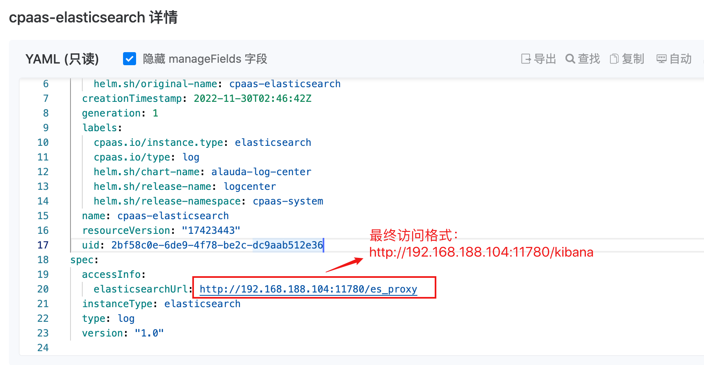

---
kind:
  - Troubleshooting
products:
  - Alauda Container Platform
  - Alauda DevOps
  - Alauda AI
  - Alauda Application Services
  - Alauda Service Mesh
  - Alauda Developer Portal
ProductsVersion:
  - 4.1.0,4.2.x
---
<!-- A type of document that involves encountering a fault, diagnosing it, performing root cause analysis, and providing solutions. -->

# 3.10业务集群访问kibana

## 环境信息 适用版本：3.10

## Cause

## Resolution
- kubectl get feature -n xxxxx cpaas-elasticsearch -oyaml 获取elasticsearchUrl地址，将es_proxy替换为kibana
- kubectl get secret elasticsearch-basic-auth 获取密码并base64解码

## [workaround]

## [Related Information]
**Screenshots**

- Environment: 3.10
- cpaas-elasticsearch
- elasticsearch-basic-auth
- elasticsearchUrl
- Component: (待归类)
- Page ID: 133076316
- Original Title: 3.10业务集群访问kibana
