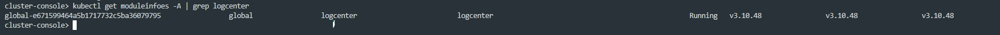
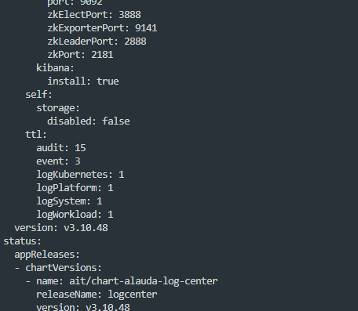

---
kind:
  - Troubleshooting
products:
  - Alauda Container Platform
  - Alauda DevOps
  - Alauda AI
  - Alauda Application Services
  - Alauda Service Mesh
  - Alauda Developer Portal
ProductsVersion:
  - 4.1.0,4.2.x
---
<!-- A type of document that involves encountering a fault, diagnosing it, performing root cause analysis, and providing solutions. -->

# 3.8、3.10修改日志保存时间超过30天

平台前端限制日志保存时间最多30天

## Cause
- 平台默认配置限制日志保存周期

## Resolution
- 通过kubectl edit修改logcenter模块的moduleinfoes资源，调整ttl字段值为期望天数

## [workaround]

## [Related Information]
**Screenshots**

- Environment: 3.8 3.10
- moduleinfoes
- logcenter
- ttl
- Component: (待归类)
- Page ID: 133080186
- Original Title: 3.8、3.10修改日志保存时间超过30天
