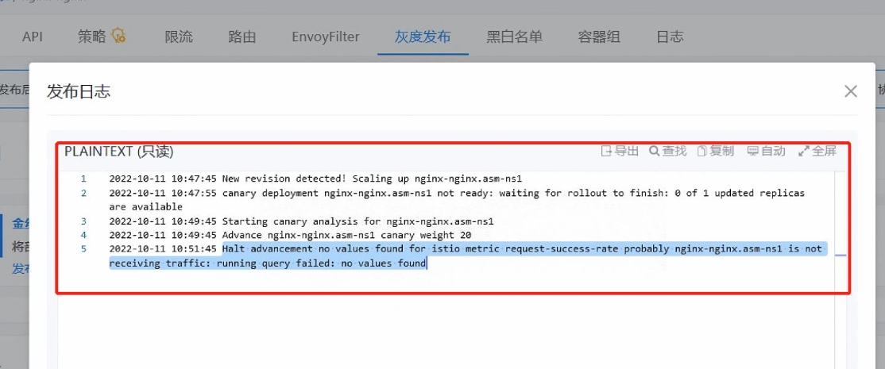

---
kind:
  - Troubleshooting
products:
  - Alauda Container Platform
  - Alauda DevOps
  - Alauda AI
  - Alauda Application Services
  - Alauda Service Mesh
  - Alauda Developer Portal
ProductsVersion:
  - 4.1.0,4.2.x
---
<!-- A type of document that involves encountering a fault, diagnosing it, performing root cause analysis, and providing solutions. -->

# 灰度发布失败

灰度发布失败 灰度版本可以正常响应返回结果

## Cause
- 微服务的协议配置错误（配置为tcp而非http）

## Resolution
- 将微服务协议配置修改为http

## [workaround]

## [Related Information]
**Screenshots**

- Environment: 3.8
- 协议配置
- 灰度发布
- Component: (待归类)
- Page ID: 133083113
- Original Title: 灰度发布失败
