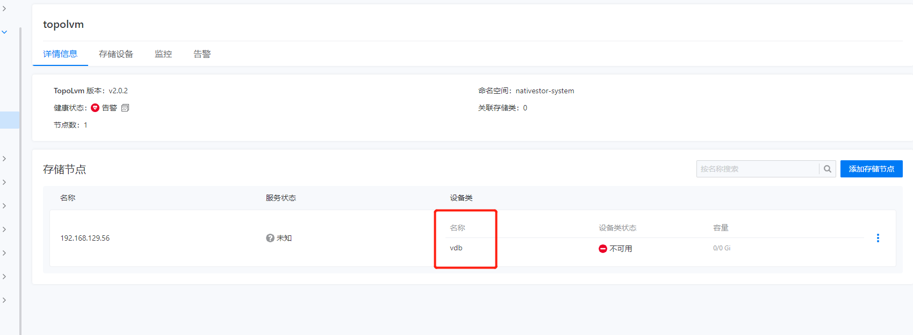

---
kind:
  - Troubleshooting
products:
  - Alauda Container Platform
  - Alauda DevOps
  - Alauda AI
  - Alauda Application Services
  - Alauda Service Mesh
  - Alauda Developer Portal
ProductsVersion:
  - 4.1.0,4.2.x
---
<!-- A type of document that involves encountering a fault, diagnosing it, performing root cause analysis, and providing solutions. -->

# 3.8.2

部署topolvm显示设备类不可用

## Cause
- 设备类名称与磁盘盘符名称相同导致识别冲突（例如设备类名称vdb与磁盘路径/dev/vdb）

## Resolution
- 修改设备类名称(如hdd/ssd)后重新部署

## [workaround]

## [Related Information]
**Screenshots**
部署topolvm成功后显示设备类不可用
- Environment: 3.6+
- 设备类名称
- /dev/vdb
- topolvm
- Component: (待归类)
- Page ID: 133091889
- Original Title: 3.8.2-容器平台-部署topolvm显示设备类不可用
