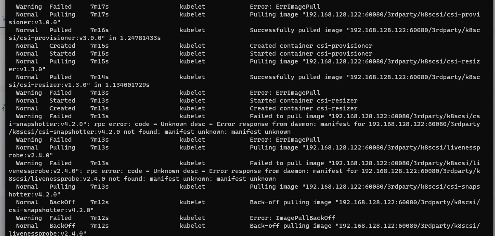

---
kind:
  - Troubleshooting
products:
  - Alauda Container Platform
  - Alauda DevOps
  - Alauda AI
  - Alauda Application Services
  - Alauda Service Mesh
  - Alauda Developer Portal
ProductsVersion:
  - 4.1.0,4.2.x
---
<!-- A type of document that involves encountering a fault, diagnosing it, performing root cause analysis, and providing solutions. -->

# 3.8.2

部署topolvm时组件无法下载镜像

## Cause
- nativestor-setting文件内topolvm镜像tag错误

## Resolution
- kubectl get cm -n nativestor-system nativestor-setting -oyaml
- 删除nativestor-system命名空间下nativestor-setting的configmap
- 删除Subscription下topolvm-operator资源
- 在存储管理-本地存储tab页点击立即配置按钮
- 验证nativestor-setting中镜像版本为topolvm:v3.8.0-huawei-isdp.4

## [workaround]

## [Related Information]
**Screenshots**

- Environment: 3.8.2
- nativestor-setting
- topolvm-operator
- 存储管理-本地存储
- topolvm:v3.8.0-huawei-isdp.4
- Component: (待归类)
- Page ID: 133091892
- Original Title: 3.8.2-容器平台-部署topolvm时组件无法下载镜像
