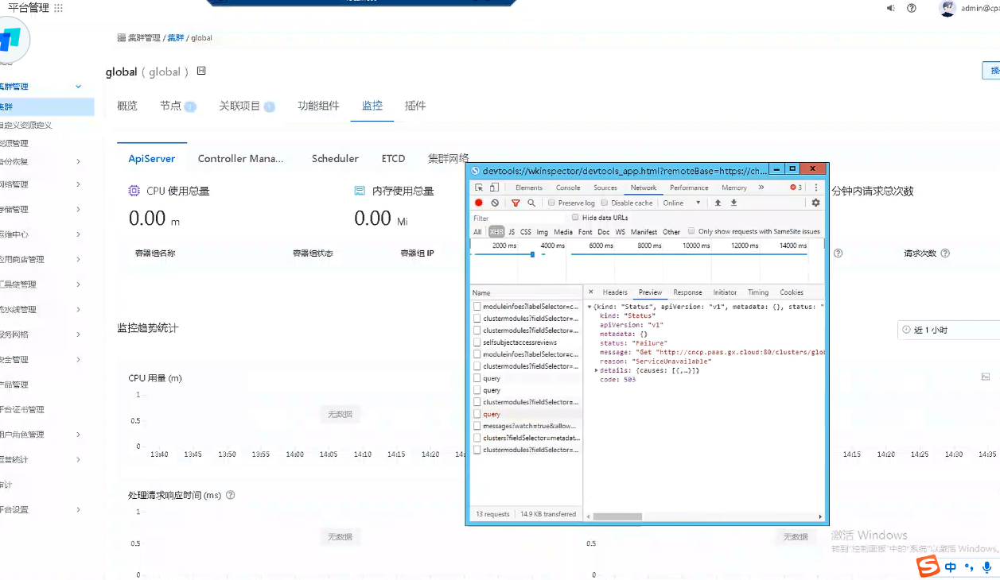
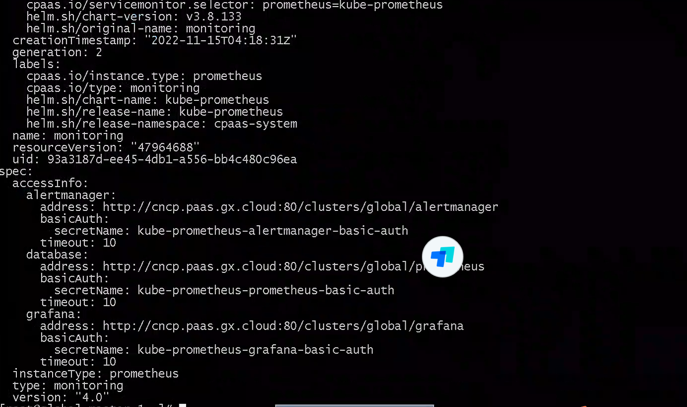

---
kind:
  - Troubleshooting
products:
  - Alauda Container Platform
  - Alauda DevOps
  - Alauda AI
  - Alauda Application Services
  - Alauda Service Mesh
  - Alauda Developer Portal
ProductsVersion:
  - 4.1.0,4.2.x
---
<!-- A type of document that involves encountering a fault, diagnosing it, performing root cause analysis, and providing solutions. -->

# 3.8.2

界面监控显示异常

## Cause
- global集群feature资源中monitoring配置仍使用http:80端口

## Resolution
- 手动调整feature资源monitoring配置为https:443

## [workaround]

## [Related Information]
**Screenshots**

- Environment: 3.8.2
- global集群
- feature资源
- monitoring配置项
- 80端口
- 443端口
- Component: (待归类)
- Page ID: 133091898
- Original Title: 3.8.2-基础架构-平台关闭http访问后，界面监控显示异常
