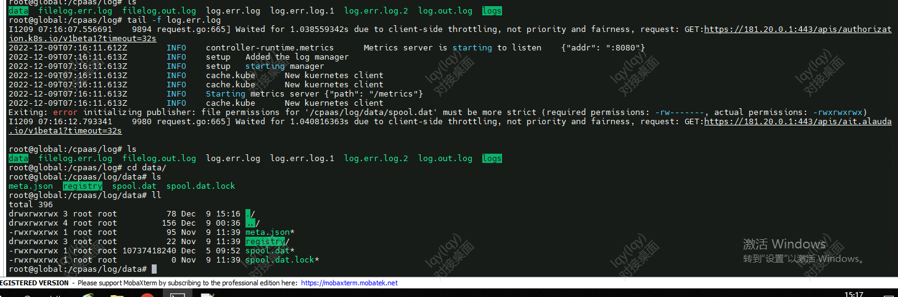

---
kind:
  - Troubleshooting
products:
  - Alauda Container Platform
  - Alauda DevOps
  - Alauda AI
  - Alauda Application Services
  - Alauda Service Mesh
  - Alauda Developer Portal
ProductsVersion:
  - 4.1.0,4.2.x
---
<!-- A type of document that involves encountering a fault, diagnosing it, performing root cause analysis, and providing solutions. -->

# 3.10.1

nevermore容器健康检查失败 Prometheus采集Metrics的Service(nevermore)无法访问 /cpaas/log/log.err.log文件权限异常

## Cause
- 主机存储盘符变更导致文件权限变更

## Resolution
- 卸载日志采集组件
- 删除/cpaas目录下audit event log目录
- 重新部署日志采集组件

## [workaround]

## [Related Information]
**Screenshots**

- Environment: 3.10.1
- /cpaas/log/log.err.log
- nevermore组件
- Prometheus Service
- Component: (待归类)
- Page ID: 133091911
- Original Title: 3.10.1-基础架构-nevermore异常触发告警
