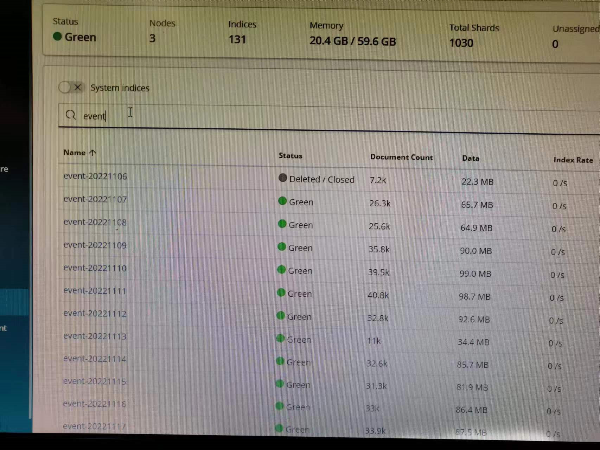

---
kind:
  - Troubleshooting
products:
  - Alauda Container Platform
  - Alauda DevOps
  - Alauda AI
  - Alauda Application Services
  - Alauda Service Mesh
  - Alauda Developer Portal
ProductsVersion:
  - 4.1.0,4.2.x
---
<!-- A type of document that involves encountering a fault, diagnosing it, performing root cause analysis, and providing solutions. -->

# 3.6.4

事件查询自定义时间选择器仅支持最近7天 实际存储索引存在30天数据但无法查询

## Cause
- 前端时间选择页面存在显示限制缺陷

## Resolution
- 升级到3.8及以上版本获取修复

## [workaround]

## [Related Information]
**Screenshots**

- Environment: 3.6.4
- 运维中心事件查询界面
- 日志存储策略配置
- Component: (待归类)
- Page ID: 133091922
- Original Title: 3.6.4-运维中心事件中只能查询7天左右的数据
