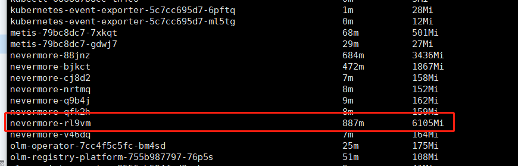

---
kind:
  - Troubleshooting
products:
  - Alauda Container Platform
  - Alauda DevOps
  - Alauda AI
  - Alauda Application Services
  - Alauda Service Mesh
  - Alauda Developer Portal
ProductsVersion:
  - 4.1.0,4.2.x
---
<!-- A type of document that involves encountering a fault, diagnosing it, performing root cause analysis, and providing solutions. -->

# 3.8.1

nevermore组件内存和cpu使用率都很高 不断oom触发节点告警

## Cause
- 3.8.1版本存在bug

## Resolution
- 升级到3.8.2版本修复

## [workaround]
- 关闭审计功能

## [Related Information]
**Screenshots**

- Environment: 3.8.1
- nevermore
- 审计
- Component: (待归类)
- Page ID: 133091934
- Original Title: 3.8.1-基础架构-nevermore不断oom触发节点告警
