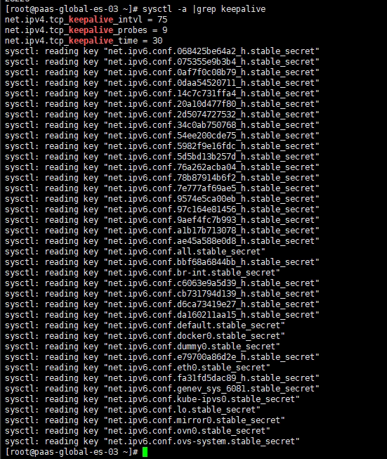

---
kind:
  - Troubleshooting
products:
  - Alauda Container Platform
  - Alauda DevOps
  - Alauda AI
  - Alauda Application Services
  - Alauda Service Mesh
  - Alauda Developer Portal
ProductsVersion:
  - 4.1.0,4.2.x
---
<!-- A type of document that involves encountering a fault, diagnosing it, performing root cause analysis, and providing solutions. -->

# 3.0.5

sentry连接数很多 tcp断开连接时长30s

## Cause
- sentry组件每次请求新建httpClient，默认keepalive方式导致长时间不释放

## Resolution
- 3.6.3版本修复
- 临时重启sentry组件恢复

## [workaround]

## [Related Information]
**Screenshots**

- Environment: 3.0.5
- sentry
- 60080
- httpClient
- Component: (待归类)
- Page ID: 133091957
- Original Title: 3.0.5-基础架构-集群master节点到vip 60080不通
