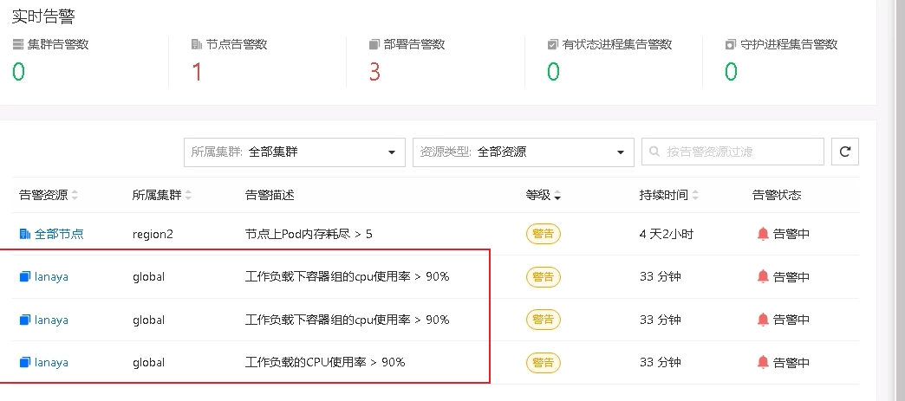
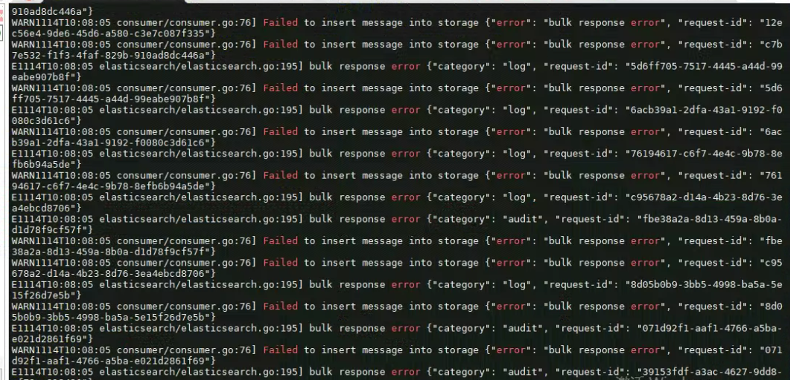

---
kind:
  - Troubleshooting
products:
  - Alauda Container Platform
  - Alauda DevOps
  - Alauda AI
  - Alauda Application Services
  - Alauda Service Mesh
  - Alauda Developer Portal
ProductsVersion:
  - 4.1.0,4.2.x
---
<!-- A type of document that involves encountering a fault, diagnosing it, performing root cause analysis, and providing solutions. -->

# 3.6.1

lanaya cpu使用率持续升高到90%以上 扩容cpu limit从2c到4c无效 日志中存在持续报错信息

## Cause
- 外部es存储磁盘空间已满
- es无法写入数据导致lanaya消费异常

## Resolution
- 清理外部es存储磁盘空间

## [workaround]

## [Related Information]
**Screenshots**

- Environment: 3.6.1版本，涉及lanaya对接es组件
- es存储
- lanaya cpu limit配置
- lanaya日志报错
- Component: (待归类)
- Page ID: 133091960
- Original Title: 3.6.1-基础架构-lanaya cpu使用率异常告警
