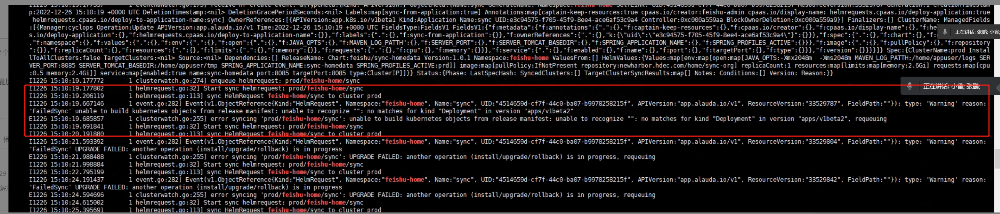

---
kind:
  - Troubleshooting
products:
  - Alauda Container Platform
  - Alauda DevOps
  - Alauda AI
  - Alauda Application Services
  - Alauda Service Mesh
  - Alauda Developer Portal
ProductsVersion:
  - 4.1.0,4.2.x
---
<!-- A type of document that involves encountering a fault, diagnosing it, performing root cause analysis, and providing solutions. -->

# 自定义应用模板部署失败

页面提示无部署信息 status.message: UPGRADE FAILED: another opertation (install/upgrade/rollback) is in progress

## Cause
- 自定义模板中deploy使用的apiversion版本与当前环境不匹配

## Resolution
- 更新自定义chart的deploy apiversion为当前环境版本
- 执行查询命令: kubectl api-versions | grep apps

## [workaround]

## [Related Information]
**Screenshots**

- Environment: 通用
- helmrequest
- captain-controller-manager
- deploy.apiversion
- Component: (待归类)
- Page ID: 133094430
- Original Title: 自定义应用模板部署失败
