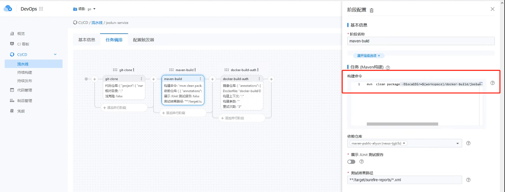
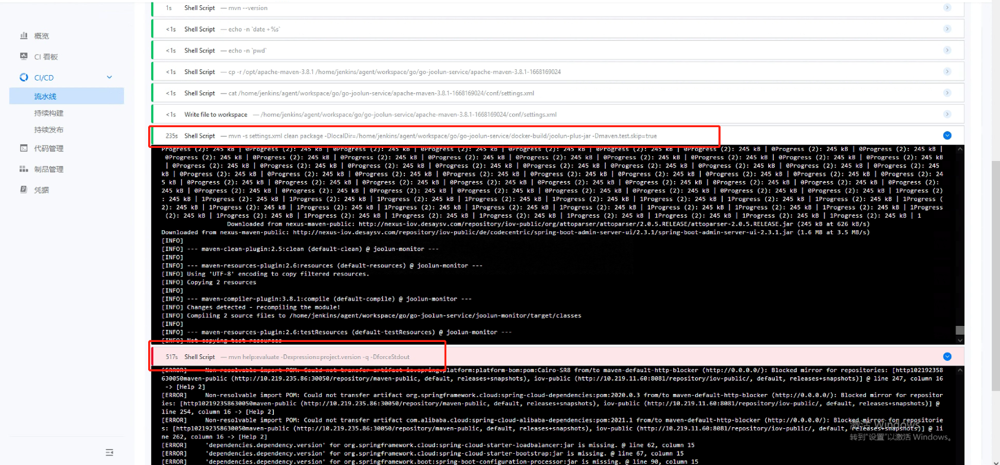

---
kind:
  - Troubleshooting
products:
  - Alauda Container Platform
  - Alauda DevOps
  - Alauda AI
  - Alauda Application Services
  - Alauda Service Mesh
  - Alauda Developer Portal
ProductsVersion:
  - 4.1.0,4.2.x
---
<!-- A type of document that involves encountering a fault, diagnosing it, performing root cause analysis, and providing solutions. -->

# 图形化maven构建模板问题

构建过程中因缺少maven-help-plugin导致超时 从中央仓库拉取依赖失败

## Cause
- maven构建流程默认从中央仓库拉取maven-help-plugin
- 外网访问超时导致构建失败

## Resolution
- 改用Java构建task
- 在构建命令中指定'mvn package -s ./settings.xml'

## [workaround]
- 临时切换构建模板类型为Java构建task

## [Related Information]
**Screenshots**

- Environment: TKE 3.8
- maven-help-plugin
- pom.xml#project.version
- settings.xml
- central仓库
- Component: (待归类)
- Page ID: 133094998
- Original Title: 图形化maven构建模板问题
